Exercise 1: Agile Project Management
----------------------------------------------------------------------------------------------------------------------------------

  In this exercise, you will learn how to use Team Foundation Server
    2015 to manage your product backlog, create work items, break work
    items into tasks, assign tasks to team members, and track progress
    using the task board. This overview will demonstrate the basic
    project management tools that small- to medium-sized development
    teams can utilize for product development.

  >**Note:** The team project used in this lab uses a Scrum process
    template, but the core features demonstrated apply to all
    process templates.

###Task 1: Team Foundation Server Web Portal

1.  Log in as **Julia Ilyiana** (VSALM\\Julia). All user passwords are
    **P2ssw0rd**.

   > **Note:** In order to fully demonstrate the ALM features in this
    lab, we will first set the virtual machine to a specific date that
    lines up with a pre-configured, in-flight iteration. This lab needs
    to be walked through using the original virtual machine state
    (without any modifications made to source or work items), otherwise
    you will see errors.

2.  **Right-click** the **ConfigureALMDemo.bat** file on the Desktop and
    then select “**Run as administrator**”. This will set the date and
    time in the virtual machine to be a specific date that lines up with
    the demonstration data.

2.  Launch **Internet Explorer** from the taskbar and click **TFS FF
    Portal** from the favorites bar at the top.

  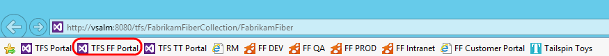

     <b>Figure 1:</b> Launching the web portal

  >**Note:** There is also a **Web Portal** link in the Team Explorer
    window within Visual Studio.

    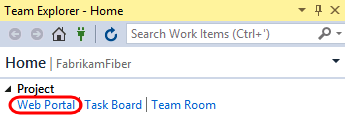

1.  Select the team drop-down box in the top-right corner of the portal
    and select the **Browse All** option.

  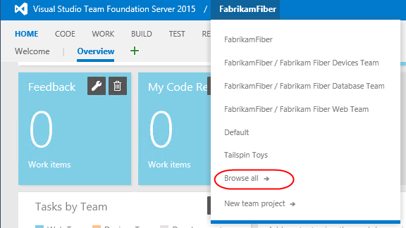

    <b>Figure 2:</b> Browsing teams

  >**Note:** There is also an option to create a **New team project**
    directly from the web site. In addition, users with the appropriate
    permissions can delete projects as well.

1.  This view shows that the Fabrikam Fiber collection has one project
    in it named **FabrikamFiber**. This project contains a few different
    teams, with the **Fabrikam Fiber Leadership Team** being set as the
    default team for the project. We will take a closer look at teams in
    a later exercise.

  >**Note:** This lab refers to this default team as both the
    leadership team and the management team. They both refer to the
    same team.

  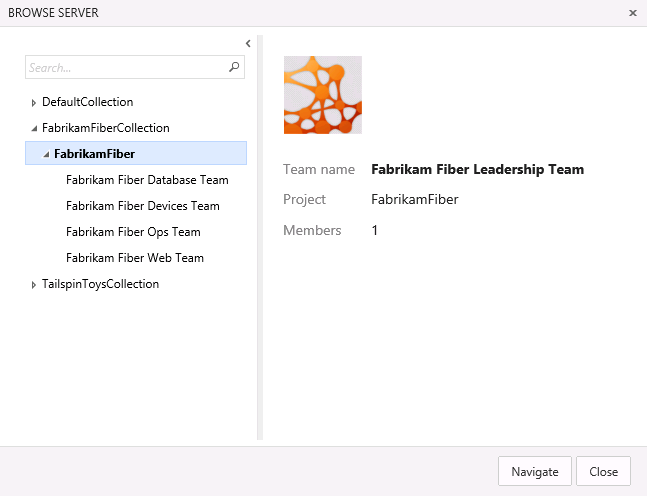

    <b>Figure 3:</b>  Browsing teams

1.  Select the **Fabrikam Fiber Web Team** and then click **Navigate**.

  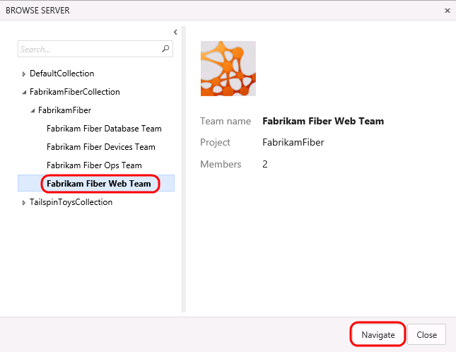

  <b>Figure 4:</b>  Navigating to a different team

1.  The **Home** view for the Fabrikam Fiber Web team provides a
    high-level overview of the current iteration (Sprint 3) including
    team workload versus capacity, burndown of tasks over time, and team
    favorites, which can include a configurable assortment of work item
    queries, build definitions, and version control paths. In addition,
    there are links to quickly create new work items and bugs, load the
    backlog, task board, initiate requests for feedback and so on.

  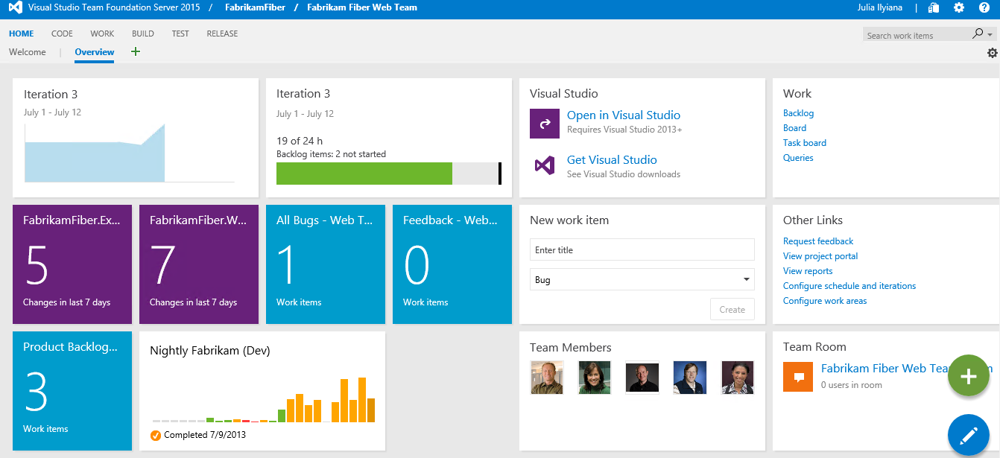

1.  Fabrikam Fiber team home view

  >**Note:** Team favorites can be added or removed from within the
    web portal. For example, navigate to the Build tab to assign build
    definitions as a team favorite. In addition, team favorite work item
    queries can be modified from within Visual Studio.

    Each team can have different team favorites listed, different work
    capacity, and even different work items. The determining factor of
    where a work item will show up is governed by the **Area** field.

1.  As you can see under the **Team Members** section, there are several
    members listed in this team. Teams are a concept that were
    originally introduced in Team Foundation Server 2012 to make it
    easier to manage, assign, and track work.

###Task 2: Working with the Backlog

1.  Navigate to the backlog by clicking **Backlog** under the
    **Work** section.

  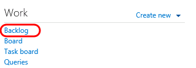

1.  Navigating to the backlog

1.  The product backlog helps define the work that needs to be done.
    Once you have a backlog, you can use it to help manage when that
    work gets done, as well as associate items on the backlog with
    check-ins, acceptance tests, or other criteria.

  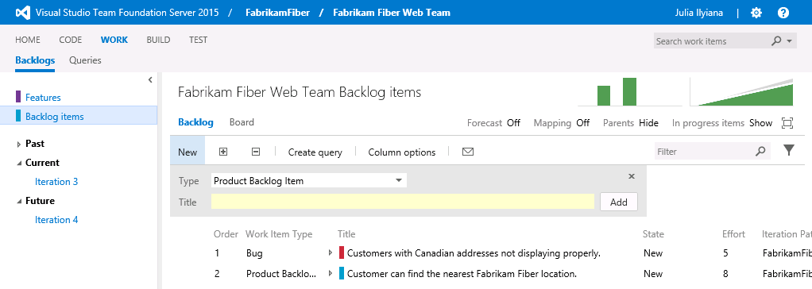

1.  Product backlog view

  >**Note:** The Current iteration shown in the tree on the left side
    of this screen is Iteration 3. Team Foundation Server uses the
    current date and time to determine the current iteration. The
    virtual machine you are using has been set to use a date of July 9,
    2013 for purposes of this lab.

1.  Imagine that the VP of Fabrikam Fiber has requested that a new user
    story be implemented for the customer-facing service portal. This
    new user story will enable customers to see weather-related
    service outages. This user story is being designated as
    high-priority because many customers requested it and customer
    service indicated that it would greatly reduce phone support
    during outages.

2.  Select the last row of the product backlog and then create a new
    **Product Backlog Item** with the title “***Customer should see
    weather-related outages on portal.”***

 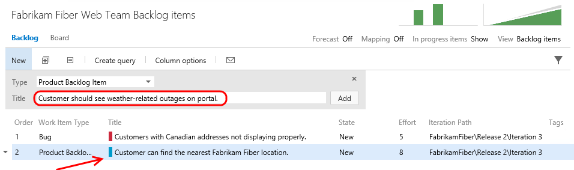

1.  Adding a new user story to the product backlog

  >**Note:** New work items are generally inserted above the
    selected location. The exception is that if you select the last work
    item, the insertion will be after the selected location.

1.  Click **Add** to add the new user story to the backlog.

  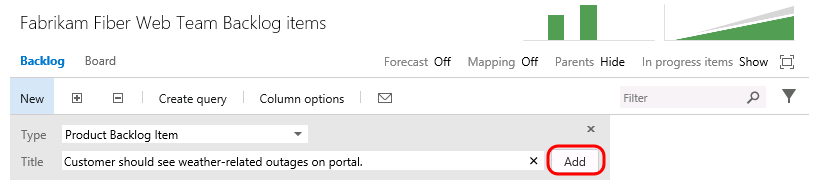

1.  Adding a new user story to the product backlog

1.  Work items on the product backlog are ordered based on priority with
    high priority items at the top. Our new work item has a high
    priority so move it to the top of the list by dragging and dropping
    it into place.

  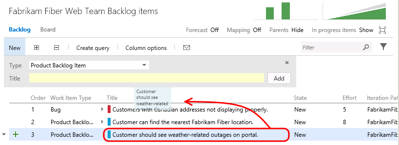

1.  Increasing the priority of the new user story

1.  Let’s edit the new user story to assign it to the appropriate
    product owner and record an initial estimate of expected effort.
    **Double-click** the new user story.

  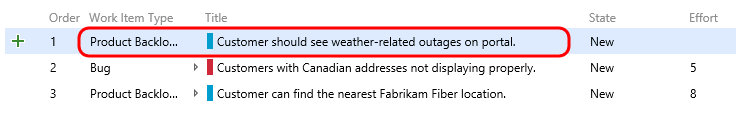

1.  Editing the new user story

1.  Assign the new item to **Brian Keller** (the product owner for the
    Fabrikam Fiber Team), set the state to **Approved**, and set an
    initial effort of ‘**8**’. Click **Save and Close**.

    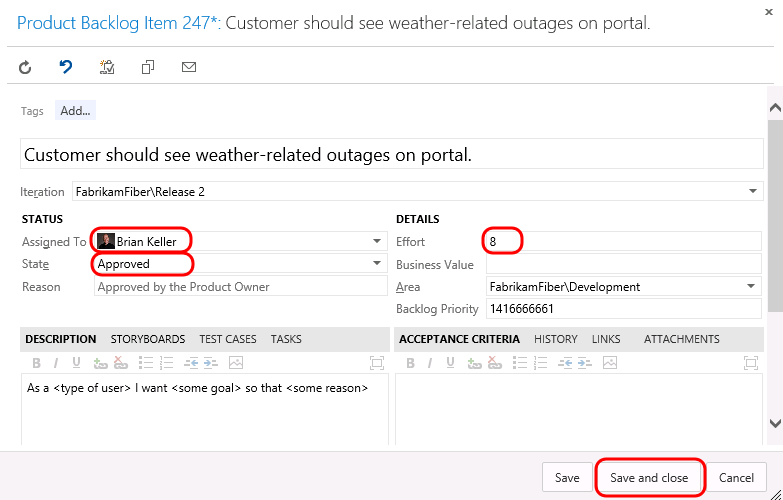

1.  Assigning the new user story and estimating effort

  >**Note:** Each team may choose to define the **Effort** value as
    they see fit, using a unit of story points, hours, days, or number
    of sodas required. The point here is that this measure is a relative
    value with respect to other work items. Work will be broken down
    into hours later.

    >**Note:** A popular planning approach that helps to eliminate group
    think and considers input from all team members is known as
    planning poker. You can read more about it at
    <http://en.wikipedia.org/wiki/Planning_poker>.

1.  Assign the new user story to the current iteration, ***Iteration
    3***, by dragging and dropping it as shown below.

  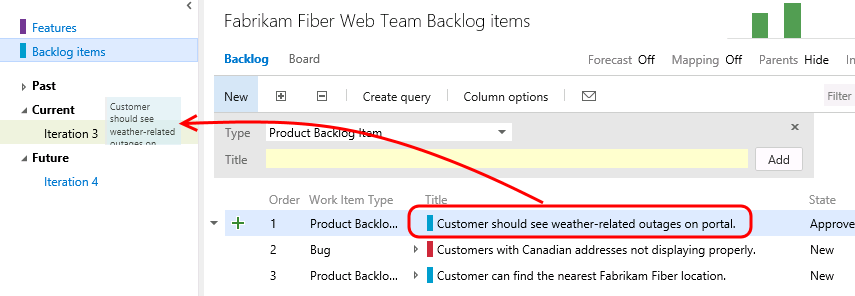

1.  Assigning the new user story to the current iteration

   >**Note:** If you are a Scrum purist, you are probably cringing at
    the fact that we just added new work to a mid-flight iteration.
    While this is something you might never do in the real world, this
    is a shortcut taken for purposes of this lab in order to simplify
    the workflow and still show you all of the aspects of the project
    management interface. Well, that and the VP told you to.

1.  Look at the **Iteration Path** for the new user story to make sure
    that it is assigned to *Iteration 3* as expected. This user story
    will remain on the product backlog until the work has
    been completed.

  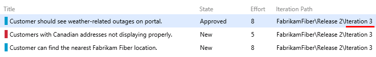

1.  Assigning the new user story to the current iteration

1.  If you made a mistake when adding a work item, or if the work item
    simply shouldn’t be part of the backlog for any reason, you can drag
    it to the **Recycle Bin**. Drag the item you just created onto the
    **Recycle Bin**. Then click the **Recycle Bin** to view
    its contents.

    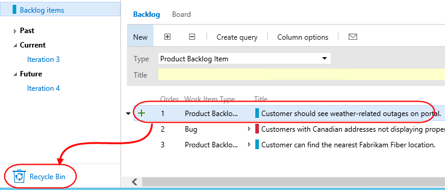

2.  Right now it only contains the item you just deleted. Fortunately,
    you can right-click the item and select **Restore** to put it back
    where it belongs. Confirm the restoration when asked.

    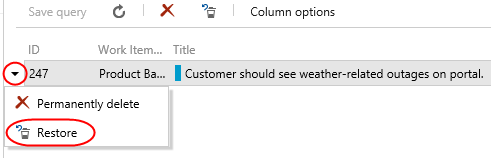

3.  It’s now time to return to the backlog. However, since you’re in the
    **Recycle Bin**, there’s no direct path. Fortunately, TFS now
    supports a variety of **keyboard shortcuts** that make rapid
    navigation as easy as possible. Press the “**?”** key (probably
    **Shift+/**) on your keyboard to view the available options.

    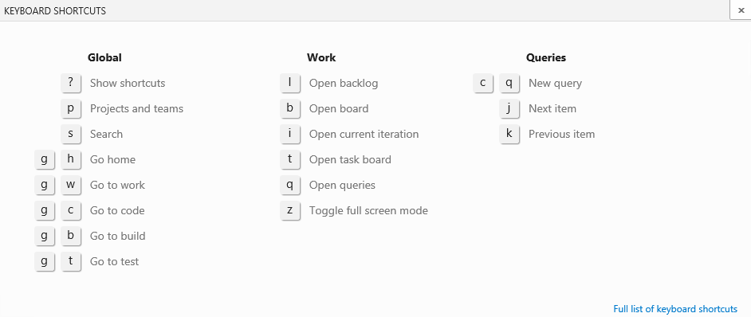

4.  The shortcut to the backlog is the **l** (lowercase “L”) key. Press
    it now to go there.

5.  The product backlog view also provides a velocity chart that shows
    the amount of work that the team has undertaken in each sprint, with
    the current sprint breaking that down further to differentiate
    between work in progress and work completed. Click the mini chart in
    the upper-right corner to load the larger view.

  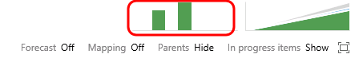

1.  Location of velocity chart

1.  During *Iteration 1*, the team completed 35 story points worth
    of effort. *Iteration 2* was more productive with 49 story
    points completed. The current iteration, represented by *Iteration
    3*, shows that we do not currently have any work items in the
    Committed state. Remember that these story points are a relative
    measure of effort that was agreed upon by the team.

  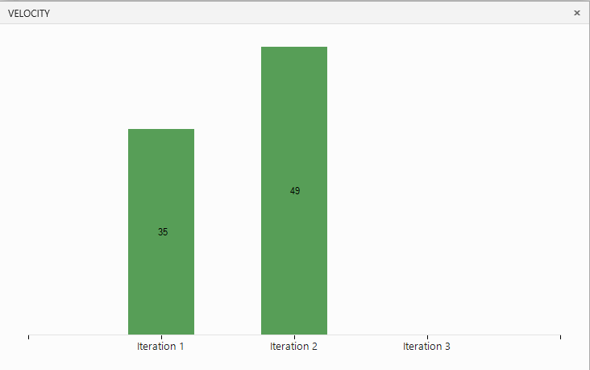

1.  Velocity chart showing progress towards completing user stories

1.  Press the **Escape** key to close the velocity chart.

2.  The product backlog view also groups the past, current, and future
    iterations by their assigned dates. Click **Iteration 3** so that we
    can break down work and assign it to the appropriate team members.

  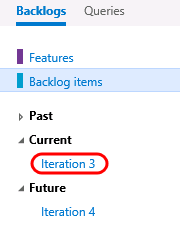

1.  Navigating to the current backlog

1.  Before we break down the new user story, let’s take a quick tour of
    this iteration backlog view. To start with, it shows all user
    stories and associated tasks that are assigned to the selected
    iteration, regardless of state.

  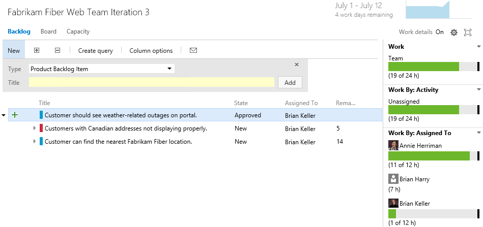

1.  Current iteration backlog view

1.  At a glance, you can see that the current iteration runs from July 1
    to 12, with four work days remaining. Just to the right of the
    current iteration date range, there is a small graph showing the
    burn down of the remaining work.

  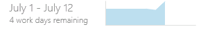

1.  Burn down graph

1.  Click the burn down graph to view it. The graph shows remaining work
    over the course of the iteration. It also provides insight for the
    **Available Capacity** that can be applied to the work (total work
    hours remaining across resources).

  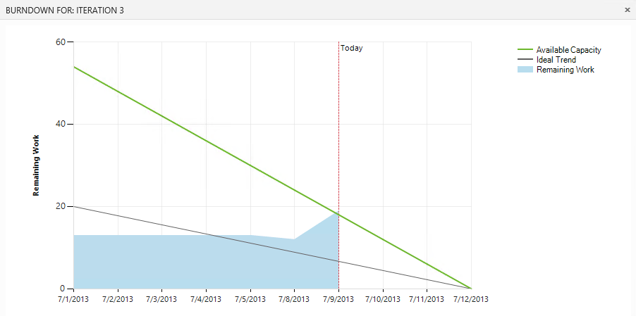

1.  Enlarged burn down graph

1.  Press the **Escape** key to close the burn down graph.

### Task 3: Team Capacity Planning

1.  Locate the overall **Work** bar that shows how close to capacity we
    are for the current iteration based on the total of the Remaining
    Work for the tasks in this iteration and based on the total capacity
    for the team. It looks like we are okay now, but we still haven’t
    broken the new user story into tasks for the team yet.

  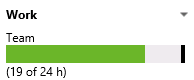

1.  Overall remaining work with respect to team capacity

1.  Select the **Capacity** tab to review the team capacity details.

  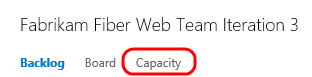

1.  Location of Capacity link

1.  The capacity view allows us to specify the number of hours per day
    that each team member will be working on this project, days off per
    team member, and overall team days off. These capacity settings
    apply to the current iteration. You can optionally use the activity
    column to describe the disciplines that each team member
    specializes in. When tasks are broken down by activity as well, it
    can provide another view across your team’s capacity to determine
    if, for example, you have enough people working on documentation to
    meet the demands for this iteration. For now, leave the capacity
    settings unmodified.

  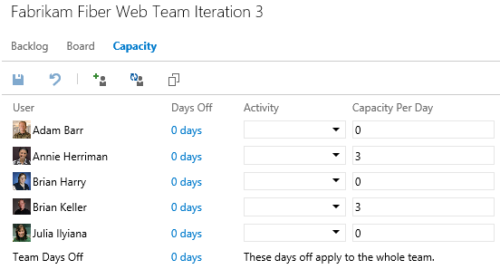

1.  Team capacity settings

1.  Return to the **Backlog** view for the current iteration.

  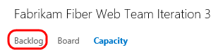

1.  Location of Contents tab

1.  Let’s say that the decision is made to proceed with committing to
    the new work item. Return to the **Iteration 3** backlog view. Click
    the button with the ‘**+**’ symbol in it to the left of the new user
    story to add a new task. This will become a child task of the user
    story and will be used to help describe the implementation details
    required to complete this user story.

  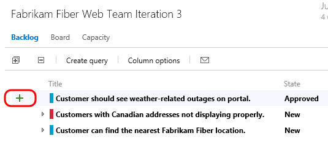

1.  Location of the button used to create new tasks

1.  For the new task, enter “**Consume OData feed for weather alerts**”
    for the Title, assign it to **Brian Keller**, and set the Remaining
    Work to **8** hours. Click **Save and Close**.

  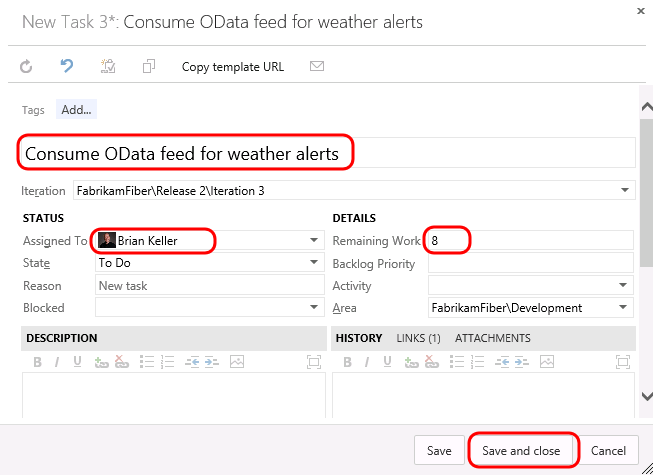

1.  Creating a new task

  >> *Note* that the new task was added as a child of the user story and
    that the overall team work bar has turned red indicating that we
    have too much work assigned based on capacity.

  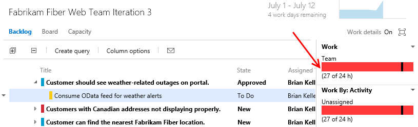

1.  Insert Caption

1.  It looks like the bug has not been worked on yet, so this may be a
    good candidate to reschedule for a future iteration so that the team
    can get back on track given their additional workload. Drag and drop
    the bug onto **Iteration 4** on the left-hand side of the window.

  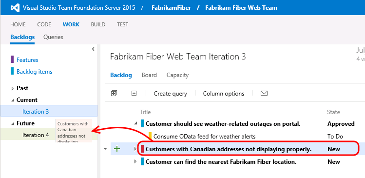

1.  Using drag and drop to re-assign work to different iterations

1.  Take another look at the overall **Work** bar once again to make
    sure it is now green. This means that we are within the current
    team capacity. Just don’t tell the VP, or he might find another
    high-priority request for us to work on!

  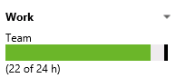

1.  Remaining work for current iteration is within team capacity
 
### Task 4: Working with the Task Board

1.  Now that we have finished breaking down the work and assigning it to
    team members, let’s take a look at the task board that will be used
    in the next stand-up team meeting to report and record progress.
    Select the **Board** tab from Iteration 3.

  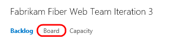

1.  Task board link

1.  By default, the task board shows all tasks for the current iteration
    grouped by product backlog item and by the current state. Drag and
    drop the “**Consume OData feed for weather alerts**” task to the
    **In Progress** column.

  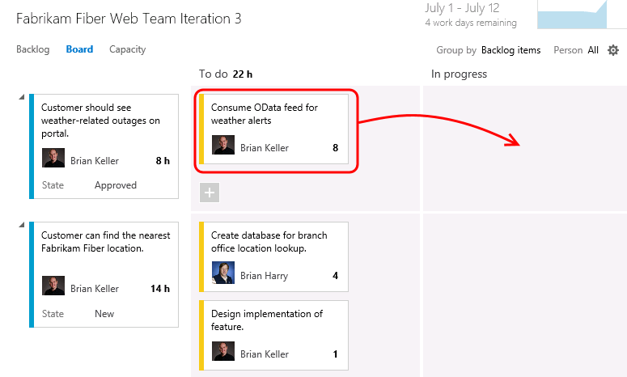

1.  Drag and drop tasks on the task board to move them between states

    >>**Note:** The task board is touch enabled as well. This will not
    work within this virtual machine, but you might want to put in your
    request now for that nice wall-mounted touch-screen monitor you have
    been desiring for your team.

    >>**Note:** Team Foundation Server 2015 has introduced numerous
    enhancements to the cards shown for tasks and Kanban views including
    styling, use of avatars, and even responsive layout based on
    browser size.

1.  **Single-click** the ‘**8**’ value shown on the “**Consume OData
    feed for weather alerts**” task and change the Remaining Work to
    **5** to simulate Brian working on the task during the day.

  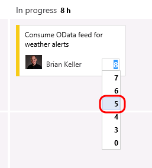

1.  Updating remaining work for a task

1.  The new high-priority task is now in progress with an estimated 5
    hours of work left to go.

  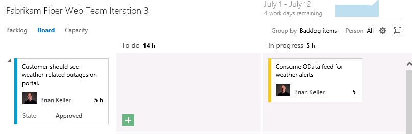

1.  Task board

1.  Drag and drop the task titled “**Create database for branch office
    location lookup**” to the **Done** column to record that work
    as completed. Note that the remaining work is automatically reduced
    to **0**.

  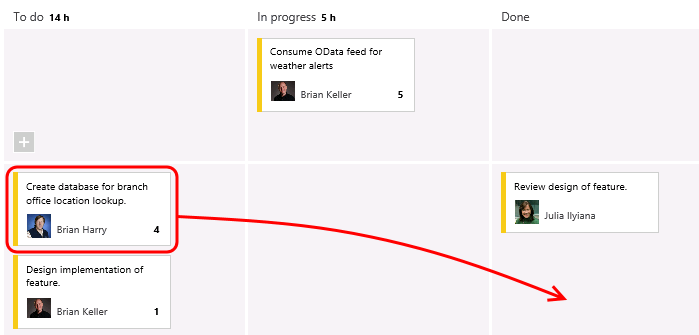

1.  Completing a task with the task board

1.  Notice that the burn down chart in the top-right corner is
    automatically updated after you made changes on the task board.
    Click the burn down chart and note that there is about 15 hours of
    effort left in order to complete the work for the iteration.

  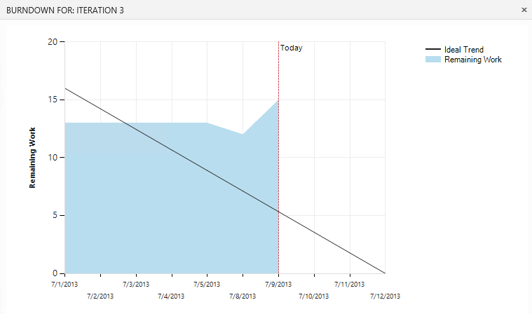

1.  Burn down chart

1.  Close the burn down chart.

2.  Note that each row representing a work item shows a rollup of hours
    remaining, which is a sum of remaining work for all child tasks. In
    addition to that each column representing a status has a rollup of
    remaining work giving you a good idea of how much work the team is
    actively working on right now.

  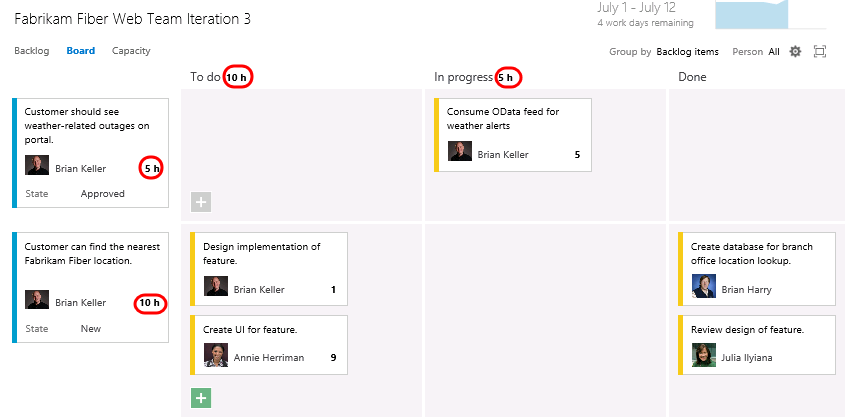

1.  Task board showing rollup of hours

1.  The task board also groups by team members. Select the **People**
    grouping option in the top-right of the task board view.

  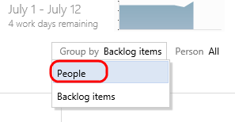

1.  Group tasks by people

1.  This view makes it easy to see what team members are currently
    working on and how much effort remains for each for the remainder of
    the current iteration.

  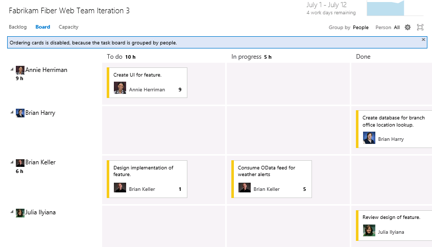

1.  Grouping tasks by people

1.  Click **Backlog Items** to return to the backlog portfolio for
    the team.

  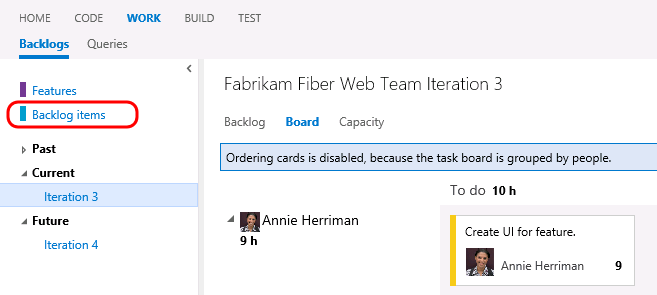

  Backlog view
