#Exercise 2: Agile Portfolio Management

1.  In this exercise, you will learn about some of the agile portfolio
    management capabilities provided by Team Foundation Server. These
    capabilities allow larger organizations to understand the scope of
    work across several teams and see how that work rolls up into
    broader initiatives. In this exercise, you will explore how multiple
    teams at Fabrikam Fiber can collaborate together to work
    on features.

###Task 1: Configuring Team Hierarchy and Area Paths

1.  Let’s start out by taking a look at the Fabrikam Fiber project from
    the top-down, in a manner that would typically be associated with a
    management role.

2.  Click the gear icon in the top-right corner of the web portal. This
    opens the administration pages in a new tab.

  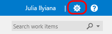

   <b>Figure 40:</b> Loading administration site

1.  Navigate to the **FabrikamFiber** project node.

  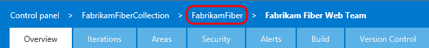

   <b>Figure 41:</b> Navigate to project node

1.  The FabrikamFiber project has five teams, with the **Fabrikam Fiber
    Leadership Team** assigned as the project default.

  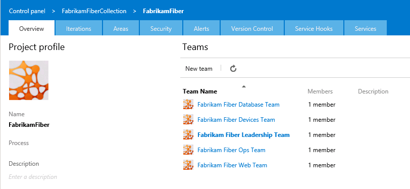

   <b>Figure 42:</b> Fabrikam Fiber teams

1.  Select the **Areas** tab.

  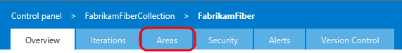
   
   <b>Figure 43:</b>  Areas tab

1.  The management team currently owns the **Development** area and
    all sub-areas. This gives them visibility into the backlog of all
    teams, even for work items that are not mapped to features.
    Optionally, the management team could also choose to not include
    sub-areas, thereby removing work items from their product backlog
    view as soon as they are assigned to one of the teams.

  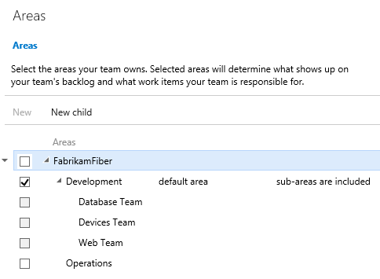
   
   <b>Figure 44:</b> Area configuration for management team

1.  Select the **Overview** tab.

  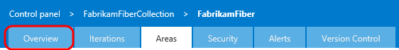

   <b>Figure 45:</b> Overview tab

1.  Click **Fabrikam Fiber Database Team**.

  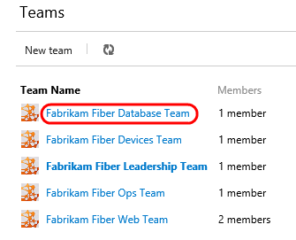

   <b>Figure 46:</b>  Fabrikam Fiber Database Team link

1.  Select the **Areas** tab.

  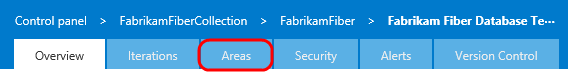

   <b>Figure 47:</b>  Areas tab

1.  The Database team is currently configured to see work items from
    just the root Development area and the Database Team sub-area. This
    allows them to see backlog items created by the management team and
    ones specifically assigned to their team. With this kind of
    structure, each team can work independently on its own backlog,
    defined by its area path, unrelated to the other team’s work.

  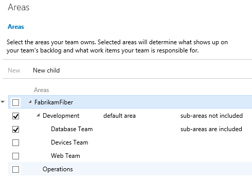

   <b>Figure 48:</b>  Area configuration for Database team

1.  Close the administration tab in Internet Explorer to return to the
    web portal browser tab.

2.  From the top navigation, select **FabrikamFiber | Browse all**.

    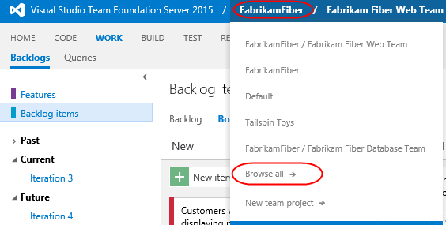

3.  Select the **Fabrikam Fiber Leadership Team** and click
    **Navigate**.

   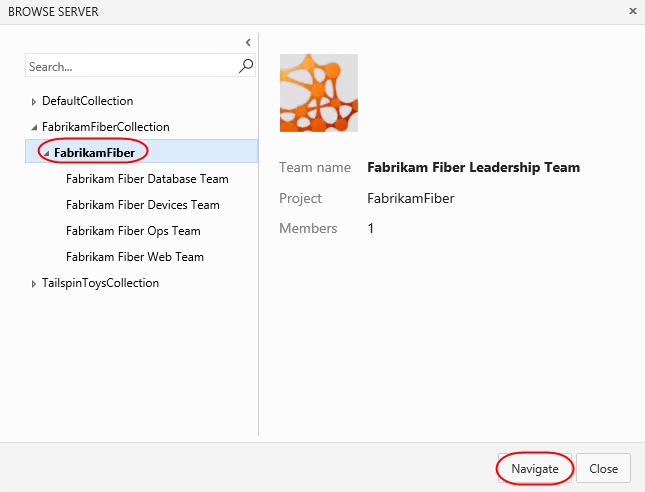

   <b>Figure 49:</b>  Navigating to management team

###Task 2: Portfolio Management

1.  Switch to the **Backlog** view if necessary.

  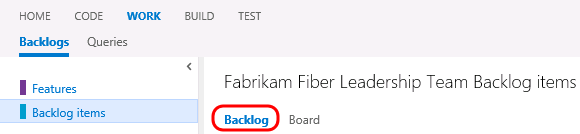

   <b>Figure 50:</b> Returning to Backlog view

1.  The leadership team can see backlog items across all teams,
    including status and scheduled iteration.

  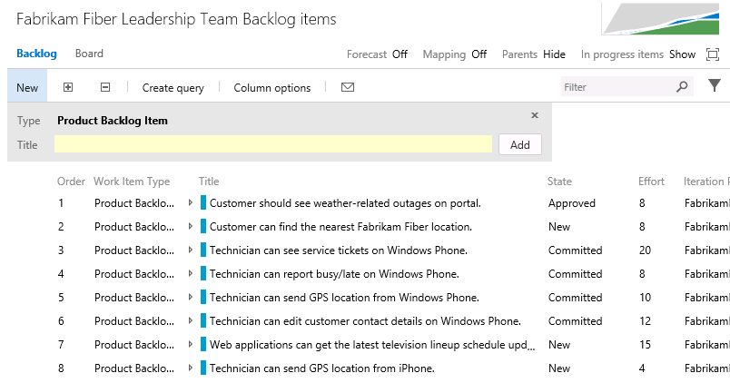

   <b>Figure 51:</b>  Backlog items for leadership team

1.  The backlog view also includes the ability to toggle the display of
    in-progress work items. Toggle the “**In progress items**” link in
    the top-right corner of the backlog view and note that the Committed
    work items are no longer displayed. Toggle the link once again to
    view in-progress items before moving on.

  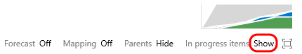

   <b>Figure 52:</b>  Location of link to show/hide in-progress items

1.  Note that the in-progress work items are no longer displayed. Toggle
    the link once again to view in-progress items as before.

  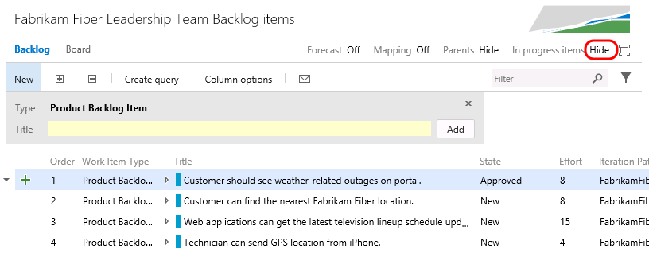

   <b>Figure 53:</b> Location of link to show/hide in-progress items

1.  Click **Features** to view the feature backlog.

   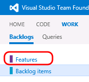

    <b>Figure 54:</b>  Viewing features backlog

1.  This view shows the top-level features for the project. It is
    possible to drill down into backlog items and even individual tasks
    if desired. Click the **Expand** button to expand one level.

   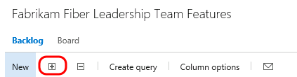

    <b>Figure 55:</b>  Expand button

   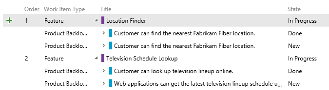

    <b>Figure 56:</b>Expanded view

1.  Click the **Expand** button once again to drill down into tasks.

   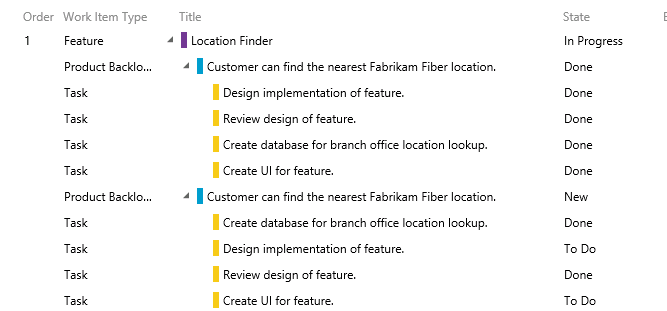

   <b>Figure 57:</b>  Expanded view

1.  It is also possible to re-parent work items using drag-and-drop
    operations in the portfolio backlog view. Try this out by dragging
    and dropping one of the Product Backlog Items from one feature
    to another.

   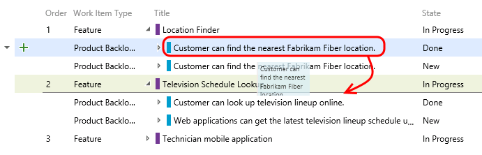

   <b>Figure 58:</b>  Re-parent work items using drag and drop

1.  Note that this moved the Product Backlog Item as well as all of the
    child tasks. Drag the Product Backlog Item back to its
    original feature.

2.  The child work items are always shown for the leadership team,
    regardless of which team they are assigned to. To see this more
    clearly, let’s add the **Area Path** column to the view.

3.  Click **Column Options**.

    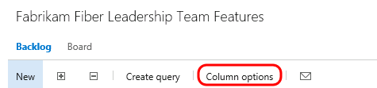

     <b>Figure 59:</b>  Column Options button

1.  **Double-click** **Area Path** from the available columns and then
    click **OK**.

    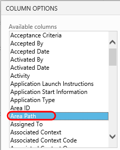

      <b>Figure 60:</b> Add Area Path column

    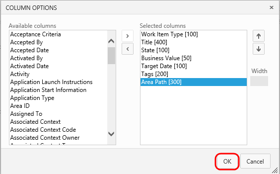

      <b>Figure 61:</b> Add Area Path column

1.  If you look at the area path column for different product backlog
    items, you can see that they are assigned to different teams. The
    ability to drill down into the various backlogs gives the management
    team the desired level of visibility into the breakdown and
    implementation of features.

   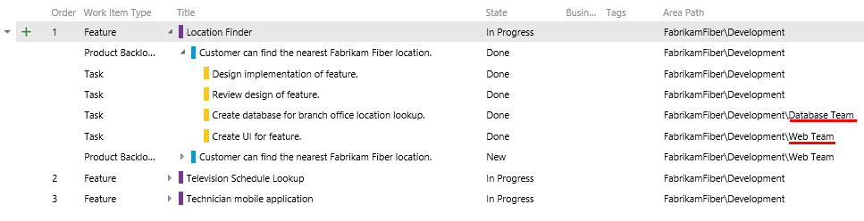

    <b>Figure 62:</b>  Area path column showing assigned teams

1.  Now let’s take a look at how to create a new feature and then link
    it to a work item that will be assigned to one of the agile teams.
    Create a new feature titled “**Reporting for technicians and
    services**” and then click the **Add** button.

   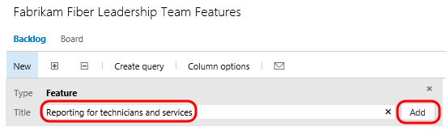

   <b>Figure 63:</b>  Creating new feature

1.  Click the green ‘**+**’ button that is on the left-hand side of the
    new Feature.

   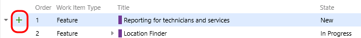

   <b>Figure 64:</b> Adding new PBI

1.  Create a new Product Backlog Item named “**Modify databases to
    support on-demand reporting for technician activity**”. Assign it to
    the database team lead, **Adam Barr**. Set the Area to the
    **Database** team so that it shows up on their backlog. Finally,
    click **Save and Close**.

   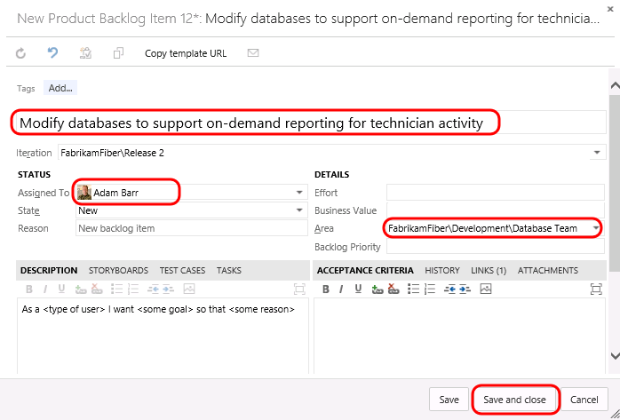

    <b>Figure 65:</b>  Adding new PBI

1.  **Note:** In the event that you create items within the backlog, you
    can also easily map them to parent Features by enabling the Mapping
    feature and then dragging and dropping.

    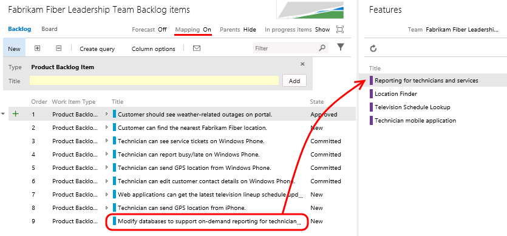

1.  Now let’s load the web portal for the database team. Navigate to the
    **Fabrikam Fiber Database Team** using the top navigation as before.

1.  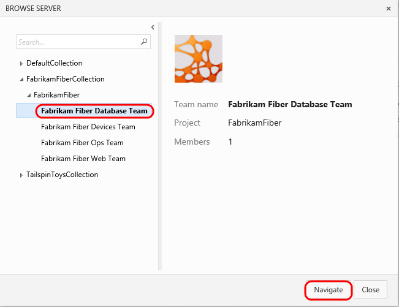

1.  Navigate to database team

1.  You should now be looking at the backlog for the database team.

1.  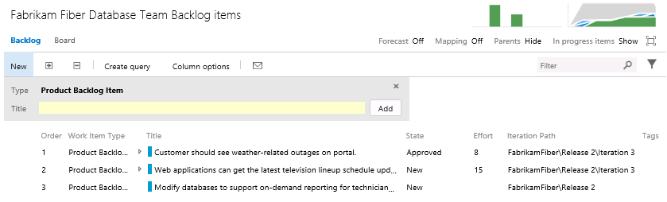

1.  Backlog Items link

1.  Although this team may normally only want to view their backlog
    items, they may also want to see how those backlog items fit in to
    the bigger picture. Toggle the **Parents** option that is currently
    set to Hide.

1.  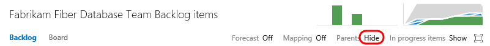

1.  Toggle display of parent nodes

1.  Note that the backlog view now shows parent Feature items.

1.  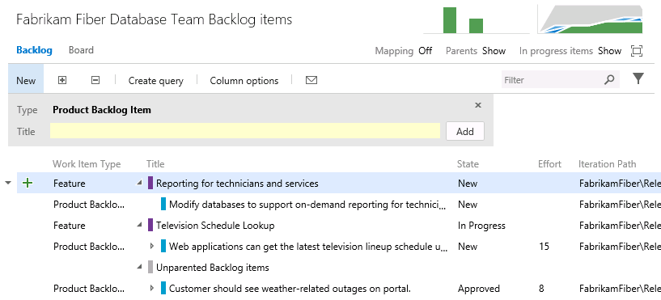

1.  Backlog showing parent features

1.  To get a more complete view of their organization’s overall work,
    the database team can also view the Features backlog. Click
    **Features**.

1.  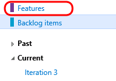

1.  Features backlog

1.  Click the **Expand** button twice in order to expand the features
    backlog two levels. Note that it is easy to distinguish between work
    that the database team is contributing to or is assigned, and work
    that is assigned to other teams by looking at the colored bar. If
    the bar is hollow (not filled in), this means that the work is
    assigned to a different team.

1.  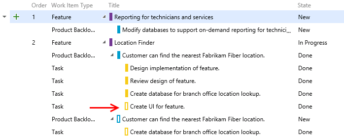

1.  Viewing work assigned to team vs. other teams
