#Exercise 3: Flexibility of Agile Tools

1.  In the previous exercise, you learned about how Team Foundation
    Server can scale to meet the needs of larger teams working towards
    common goals. This approach requires that everybody in the
    organization uses the same team project within Team Foundation
    Server and therefore the same process template (which defines the
    way work items and their workflows are defined). Understanding this,
    Microsoft has begun to allow individual teams to customize certain
    aspects of the ways in which they manage and track their work
    without requiring centralized changes to their process templates.

    In this exercise, you will learn more about Kanban and how it
    contributes to the flexibility of the agile toolset. You will also
    learn about work item tagging. Both of these features can be
    utilized and customized independently by different teams, without
    making changes to the underlying process template.

###Task 1: Introduction to Kanban Tools

1.  The **Kanban** board was first introduced with Team Foundation
    Server 2012 Update 1. Kanban is a process improvement tool that can
    be used in an incremental fashion regardless of the current software
    development methodology that you are using. It assists with the
    throttling and tracking of work and illustrates the delivery of
    value over time to the project stakeholders. Each backlog has its
    own Kanban board, and each team has its own view of that.

2.  Navigate to the **Fabrikam Fiber Devices Team**.

  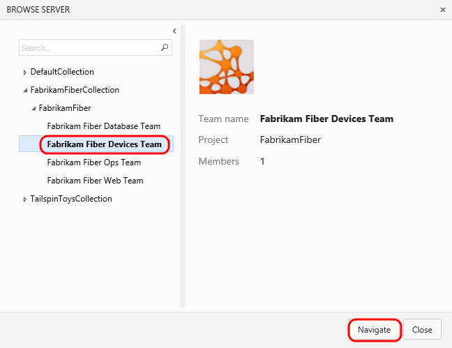
  Navigate to devices team

1.  Navigate to the backlog Kanban board for this team.
    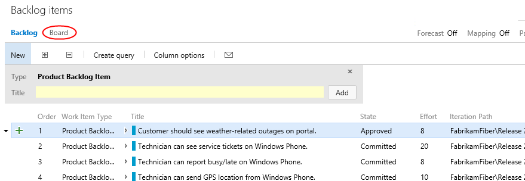
 Kanban board link

1.  The Kanban board shows the top backlog items across all states and
    iterations allowing you to move items between states and allows you
    to set Work in Progress (WIP) limits for each state. One of the
    primary reasons for using Kanban and limiting work in progress is
    that it helps identify bottlenecks in your development process and
    minimize lead time for new features. Let’s say that the devices team
    is not delivering finished work as quickly as desired, and that it
    is suspected that the underlying issue may have to do with taking on
    too many tasks at once at the beginning of each sprint (and the
    associated context-switching tax). If we are more careful about the
    number of tasks that we commit to, perhaps we can better focus
    our efforts.

2.  Let’s lower the **Work in Progress** limit for the **Committed**
    state to see what the Kanban board looks like when too much work has
    been committed to at once. Right now, the limit is **5** work items.

   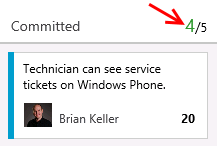
    WIP limit

1.  Click the **Configuration** button (it has a gear icon) to open the
    **Configure settings** dialog.

  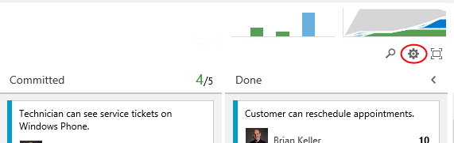

1.  Select the **Columns** tab and click the **Committed** column. Set
    the **WIP Limit** to “3” and click **Save and close**.

  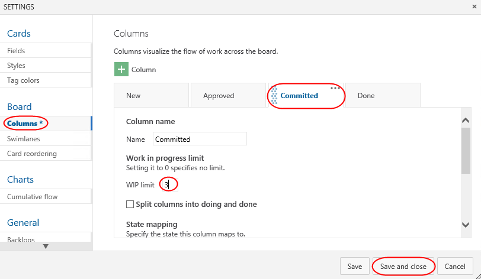

  Setting WIP limit

1.  On the Kanban board, column headers will provide an indication when
    a Work in Progress limit is exceeded. In this case, the Committed
    column shows us that we have exceeded the limit.

  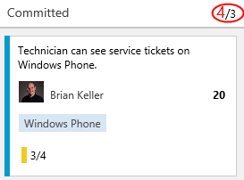
  WIP limit exceeded

1.  **Note:** Work in Progress limits provide feedback when appropriate
    but they do not prevent a team from taking on additional work. You
    need to actively check the Kanban board in order to discover that
    you are exceeding set limits.

1.  You can also configure the Kanban boards to show (or hide) bugs
    as desired. Click the gear icon in the top-right corner of the
    window to open the administration page in a new browser tab.

    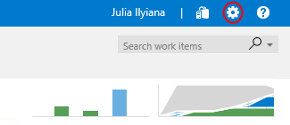

2.  Navigate to the **Settings** tab for the **Fabrikam Fiber Devices
    Team** and scroll down to locate the **Bugs** section.

  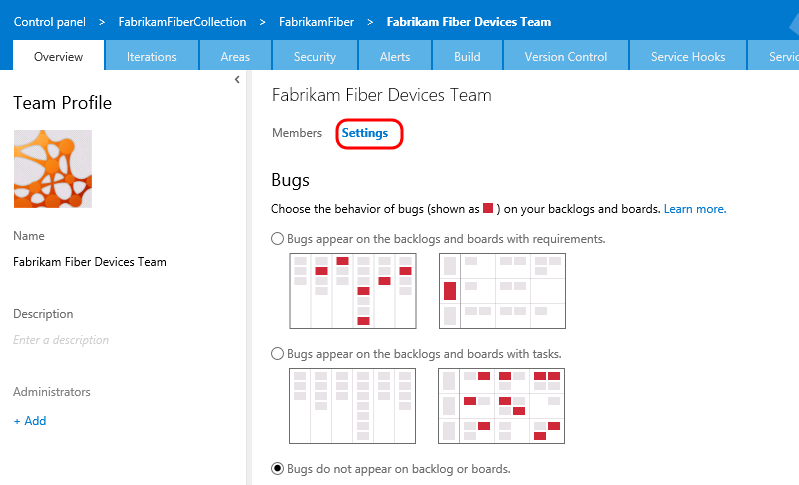
  Team settings

1.  Change the **Bugs** option so that “**Bugs appear on the backlogs
    and boards with requirements**”.

  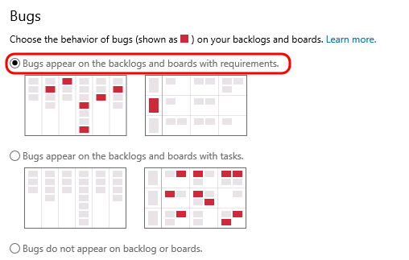
  Configuring bugs to show up on backlogs and board views

1.  Close the administration settings browser tab to return to the
    Kanban board view for the team and refresh the page.

2.  Click the **New Item** button and then select **Bug**.

1.  **Note:** Adding new cards and inline editing are two new features
    in Team Foundation Server 2015.

  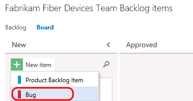
  Adding a new bug directly on the Kanban board

1.  Add a new bug entitled **“Rendering artifacts on iPhone”** and then
    press **Enter** to save.
  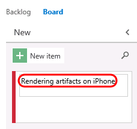
  Adding new bug

1.  You can also reorder the backlog priority from the Kanban board. In
    the **Committed** column, drag the bottom card to the top of
    the column.

    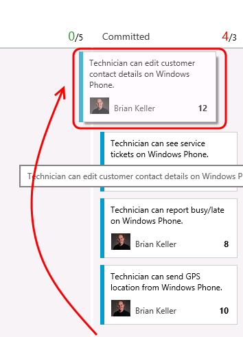

     Reorder cards

1.  Filtering on the Kanban board is another new feature of Team
    Foundation Server 2015. Click the **Search** button and then search
    for “**technician**”.

  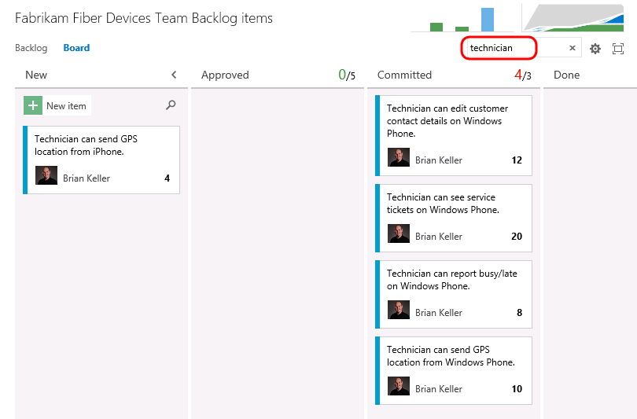
  Kanban board search filter

 1. **Clear** the search box.

  >>**Note:** The New column has an additional search filter box that
    only applies to work items in the New state, which is useful when
    you want to search for something from your backlog without losing
    context of other work items.

1.  Let’s say that the devices team has decided that they want to add in
    a column that represents work that has been tested on a
    physical device. This is the only team that would desire to keep
    track of such a state, and they can easily add this to their
    Kanban board.

2.  Click the **Configure settings** button. Here you can add, remove,
    delete, and even rename columns to better suit your team workflow.
    However, you are still subject to restrictions put in place by the
    underlying process template, so you must map columns to valid work
    item states and respect the valid state transitions.

    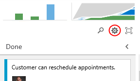

3.  Navigate to the **Columns** tab and click the **+ Column** button.
    Reorder the new column to be next to **Done** and set its **Name**
    to “Device Tested”.

    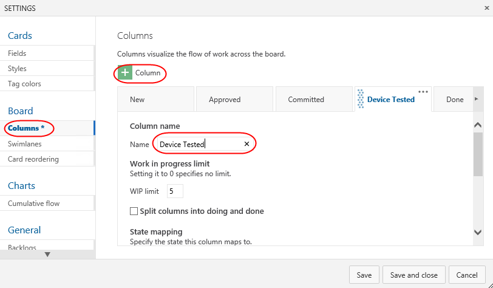
       Adding a new column

1.  You can also modify what your team considers to be the meaning of
    the Definition of Done for each Kanban column. This will help teams
    to stay on the same page even when a work item should be moved to
    the next state. Scroll down to the bottom of the form and define the
    definition of “done” for this column using plain text or Markdown.
    Provide a message such as “**Has been tested on Android, Windows
    Phone, and iPhone**” and then click **Save and close**.

    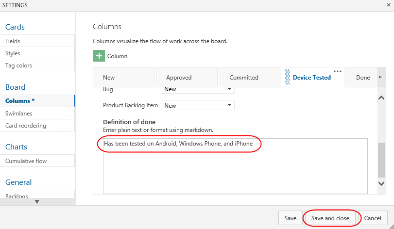

2.  You new column is now live on your board, and you can click the
    helper icon to see the **Definition of Done**.

  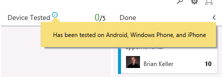
   Kanban board showing customizations for team

1.  Kanban support also adds a new graph to the backlog views called the
    **Cumulative Flow Diagram**. Click the small diagram to open it.

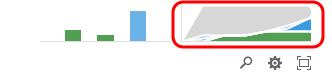

<!-- -->

1.  Figure

<!-- -->

1.  Cumulative Flow Diagram location

<!-- -->

1.  

<!-- -->

1.  The Cumulative Flow Diagram (CFD) shows the amount of work in
    various states over time for the selected team. The horizontal axis
    shows lead time and the vertical axis shows work in progress.

<!-- -->

1.  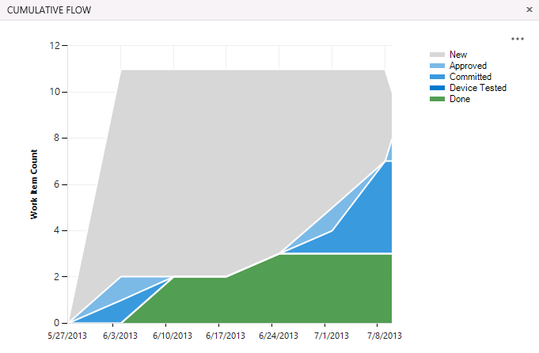

<!-- -->

1.  Figure

<!-- -->

1.  Cumulative Flow Diagram

<!-- -->

1.  

<!-- -->

1.  **Note:** The CFD shown above does not necessarily represent an
    ideal scenario where a team is providing continuous output. More
    typically and ideally, you would see bands of color representing all
    states increase over time like the following diagram.

    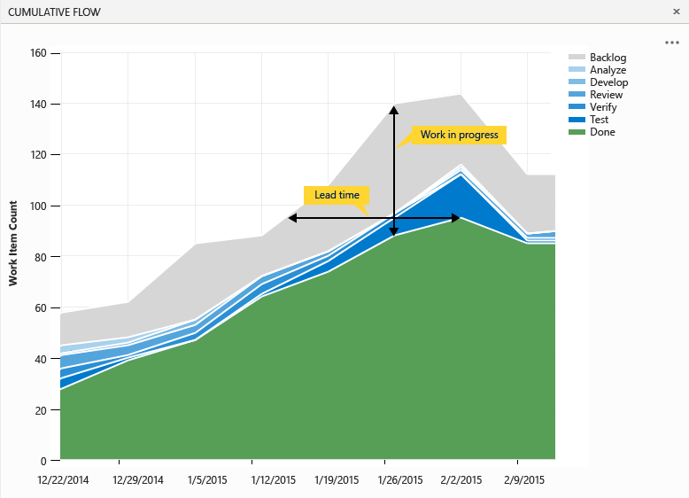

<!-- -->

1.  Press the **Escape** key to close the CFD.

2.  The Kanban board has a ton of great and convenient configurability
    options designed to adapt to the way your team works. Reopen to the
    **Configure settings** dialog used earlier.

    

3.  Navigate to the **Fields** tab. Here you can configure each work
    item type to show ID number, Assigned to field, Effort, Tags, or
    other fields that you wish to show. These options are configured per
    team, giving each team the flexibility it needs to manage its
    own workflow. Select the options to **Show ID** and **Show empty
    fields**.

<!-- -->

1.  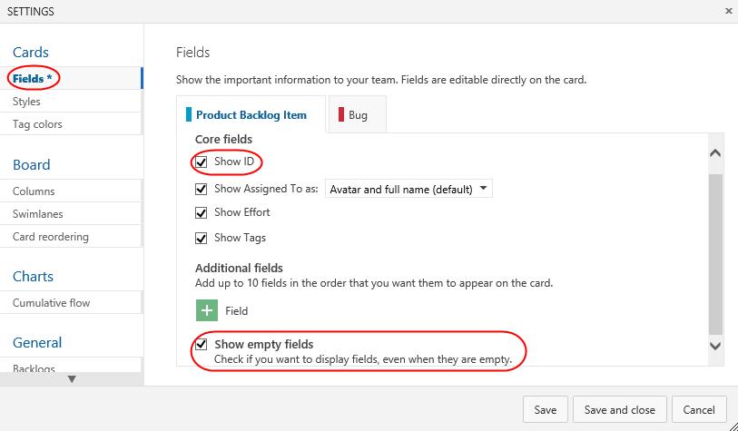

<!-- -->

1.  Figure

<!-- -->

1.  Configuration options

<!-- -->

1.  Switch to the **Bug** tab and check the same boxes here as well.
    Click **Save and close** to confirm.

    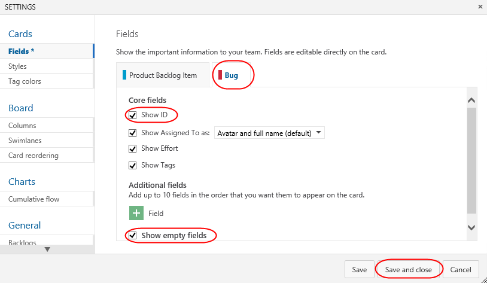

2.  Now each work item displays its ID, which is very useful if your
    team uses these in discussions or in references from code
    or documentation.

    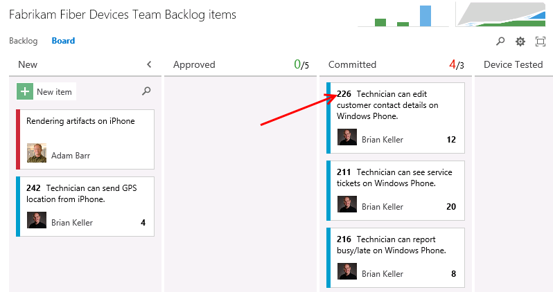

3.  In addition, the empty fields are now “shown” in the card, which
    allows you to initialize them inline. Locate the item created
    earlier and assign it to **Adam Barr**.

    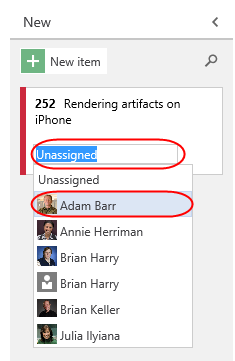

4.  The concept of swim lanes is also new in 2015. These horizontal
    lanes can be added to Kanban boards to further categorize work, with
    a common use of this to create an “expedite” lane for high-priority
    work that needs to skip through the normal workflow. Reopen the
    **Configure settings** dialog used earlier.

    

5.  Kanban boards only have a single swimlane by default, you can add in
    as many lanes as you want. For example, you can use them to
    categorize items by severity (expedite, normal), departments, tiers,
    and so on. Navigate to the **Swimlanes** tab and add a new swimlane
    named “**Expedite**”.

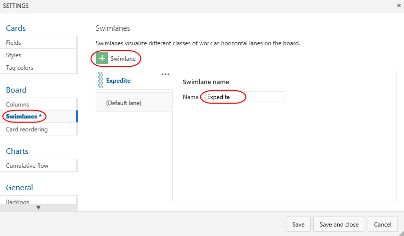
  Adding new swimlane

1.  Rename the default lane to “**Normal**” and then click **Save and
    close**.

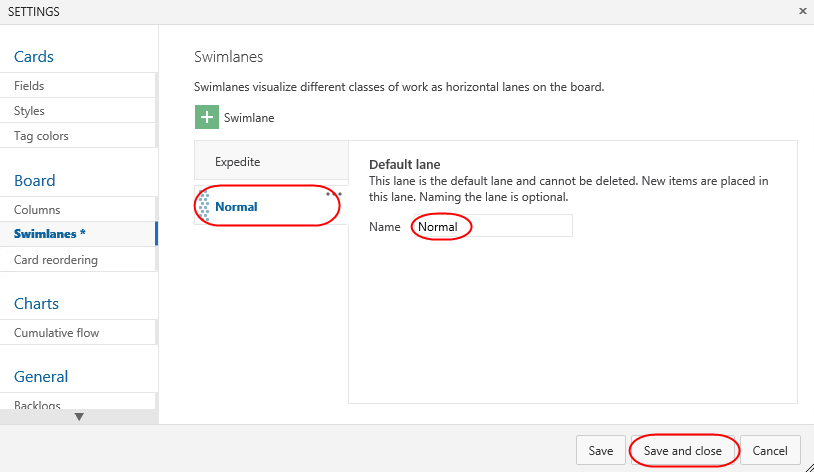
  Customizing swimlanes

1.  Expedite one of the work items using drag and drop.

  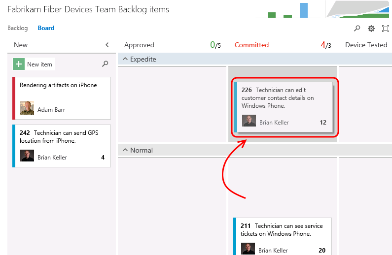
 Drag and drop cards to change swimlanes

1.  In addition to the customization of board behavior, the cards
    themselves can be easily styled. Click the **Configure settings**
    icon button to open the configuration dialog.

    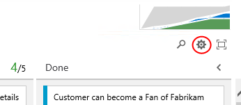

2.  Select the **Styles** tab and click **Styling rule**. Set the
    **Name** to **“High severity”**. This rule will change the style of
    the cards for bugs with high severity in order to make them easier
    to identify.

    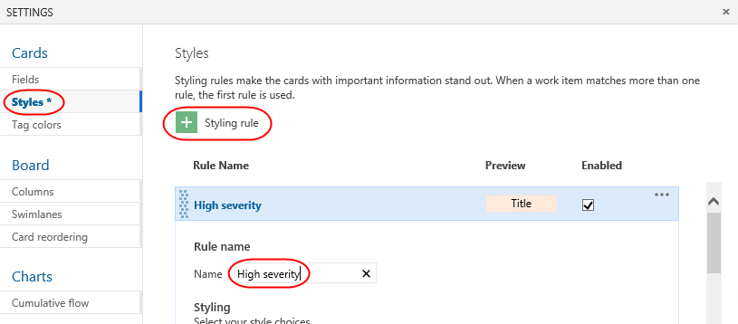

3.  Scroll down to change the **Card color** to a strong red and set the
    first clause to **“Severity = 1 – Critical”**. Note that you’ll need
    to manually enter the field name of **“Severity”**.

    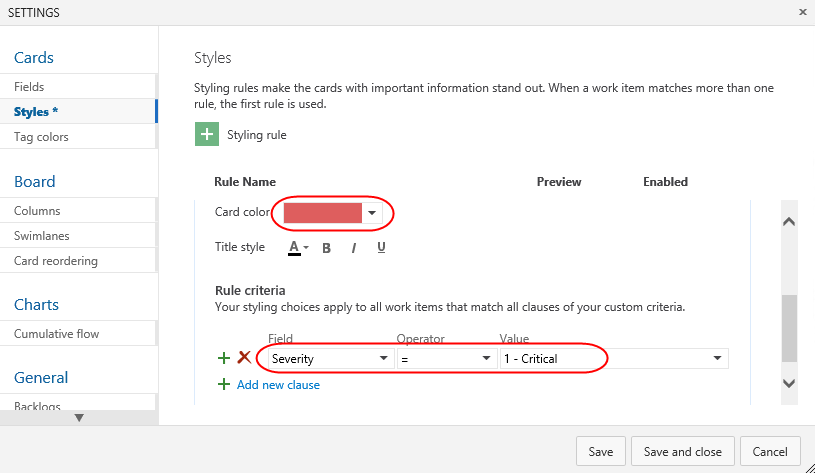

4.  Select the **Tag colors** tab and set a tag coloring rule to easily
    identify all cards tagged with **“Windows Phone”**. Click **Save and
    close** to continue.

    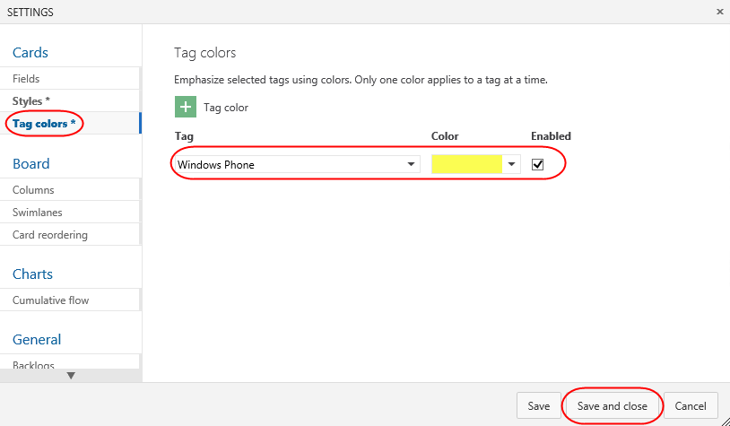

5.  On the board, you can now see that backlog item tags for **“Windows
    Phone”** are colored yellow and are easy to identify.

    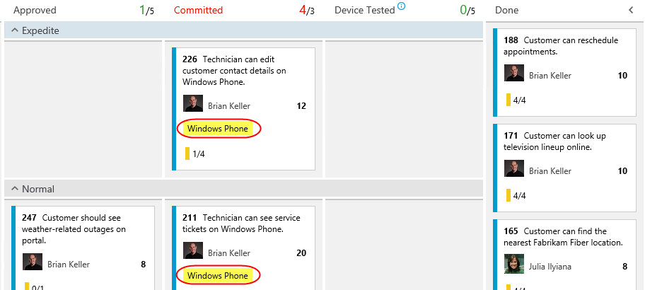

6.  Locate the bug created earlier and click the ellipses button and
    select **Open**.

    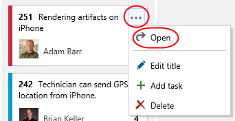

7.  Change the **Severity** to **1 – Critical** and click **Save and
    close**.

    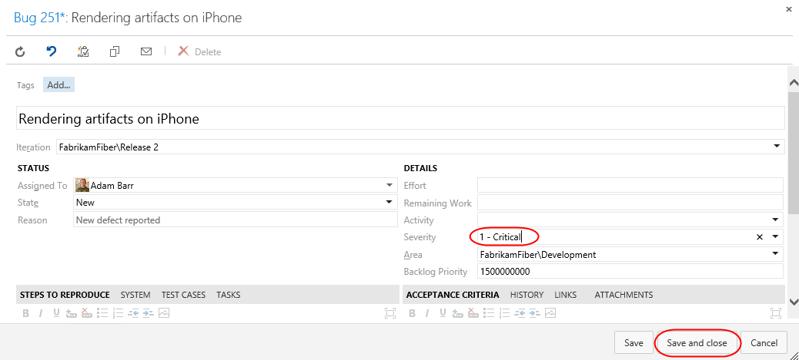

8.  Note that the bug card is now colored red to indicate its
    critical severity.

    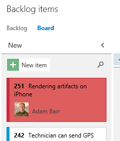

#### Task 2: Kanban prioritization

1.  As cards are reordered within a column on the Kanban board, their
    > relative priorities are adjusted in the backlog. Select the
    > **Backlog** tab and notice that the “Technician can see service
    > tickets…” work item is prioritized above “Technician can
    > report busy/late…”.

    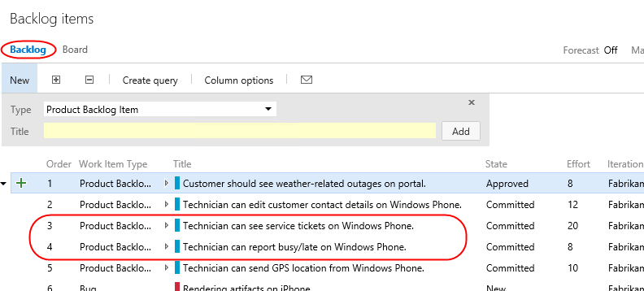

2.  Return to the **Board** tab. Locate item \#216 and drag it
    > above \#211.

    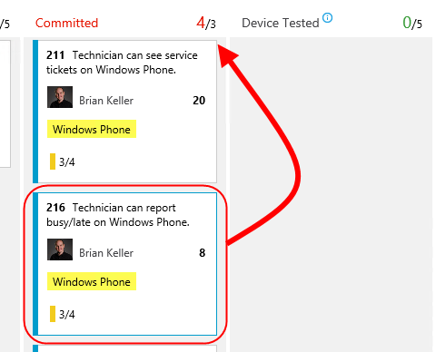

1.  With the cards now reordered on the board, return to the **Backlog**
    tab and notice that the work items have been appropriately
    reprioritized to reflect their order on the board. Also note that
    “Customer should see weather-related outages…” has the highest
    priority in the backlog.

    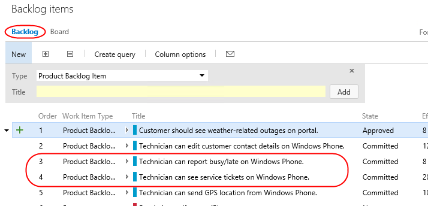

2.  Return to the **Board**. Drag—but do not drop—the “Customer should
    see weather-related outages…” card from the **Approved** column over
    the **Committed** column. Note that as you move it vertically, the
    existing cards in the column move to allow you to drop it anywhere.
    Return to drop the card over its original **Approved** column so
    that no changes are made.

    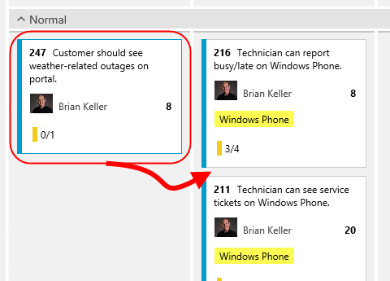

3.  While this may be desirable to some teams, there are other teams
    that would prefer backlog item prioritization to be enforced as
    cards are moved between columns. After it, it can be difficult to
    understand where a card is currently prioritized as you graduate it
    from stage to stage. Click the **Configure settings** icon button to
    open the configuration dialog.

    

4.  Select the **Card reordering** tab and select the second option.
    This will enforce that cards are placed in the appropriate place in
    a given column based on their relative priority in the backlog. Note
    that both options have sample animations to illustrate
    each behavior. Click **Save and close**.

    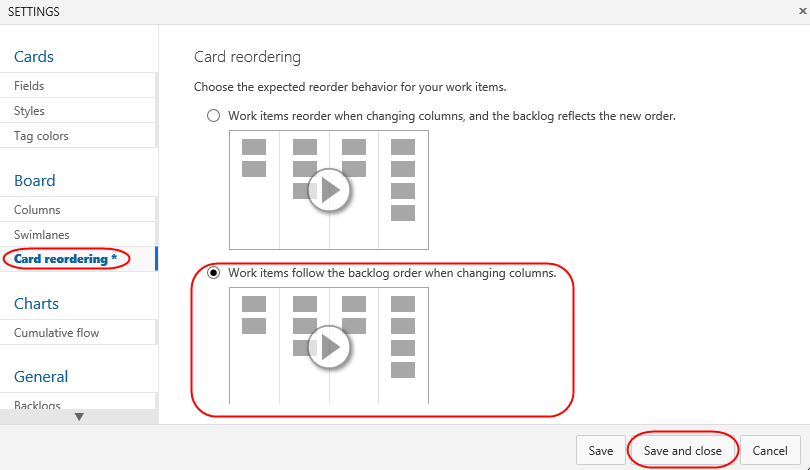

5.  Once again, drag the card from the **Approved** column over the
    **Committed** column. Note that this time, the cards in the target
    column don’t budge. Go ahead and drop it anywhere over the
    **Committed** column and note that it automatically flows to the top
    since it has the highest priority of the items in that column.

    

6.  It’s important to note that while this setting controls the behavior
    of card reordering when a card it moved between columns, you can
    still easily reorder cards within a given column. For additional
    information on using the Kanban board, please see “[Kanban
    basics](https://msdn.microsoft.com/Library/vs/alm/Work/kanban/kanban-basics)”.
 

###Task 3: Work Item Tagging

1.  **Work item tagging** allows you to easily categorize, query and
    filter lists of work items.

2.  Navigate to the **Fabrikam Fiber Leadership Team**.

 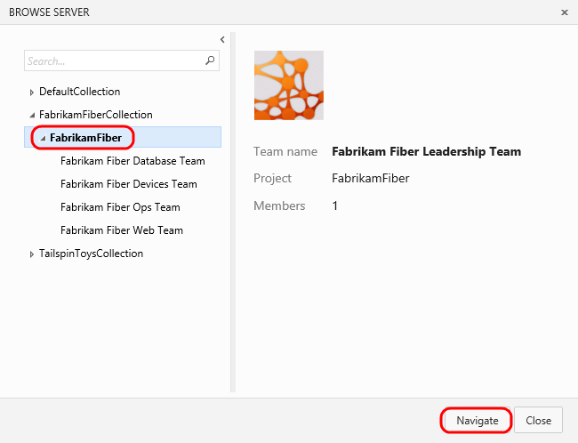

  Navigating to management team

1.  Navigate to the **Backlog Items** view.

  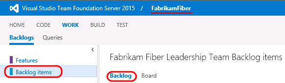

 Backlog Items list

1.  Let’s say that a cross-team initiative is put in place to give
    customer facing work items higher priority. Also imagine that the
    product backlog is quite large, so much that visually searching
    through all titles and assigning them to sprints and teams has
    become quite time consuming. One way to help with this is to create
    work item tags and then filter the list of work items.

2.  Note that a number of work item tags are already in place.

  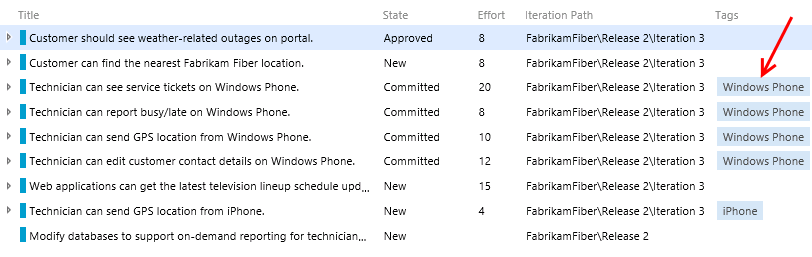
  Backlog showing work item tags

1.  **Double-click** the work item titled “**Customer should see
    weather-related outages on portal**”.

2.  Click **Add…** to add a tag.

  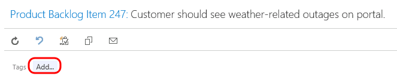

  Add button

1.  Enter the text “**Customer**” and then click **Save and Close**.

  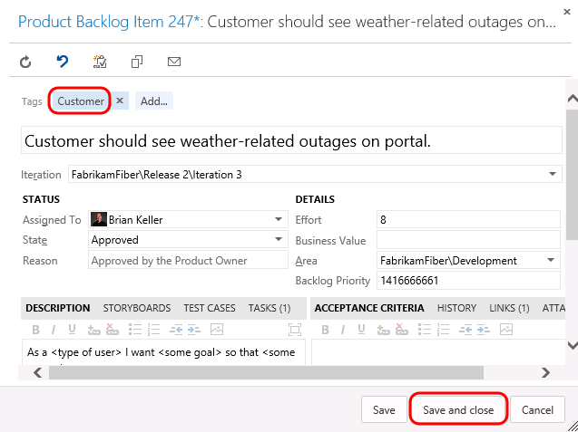

 Adding ‘Customer’ tag

1.  Repeat the process of tagging any work items that appear to be
    customer facing. You should end up with something like the following
    screenshot, but there is no need to match it exactly.

1.  **Note:** You can create work item queries that include tags.

  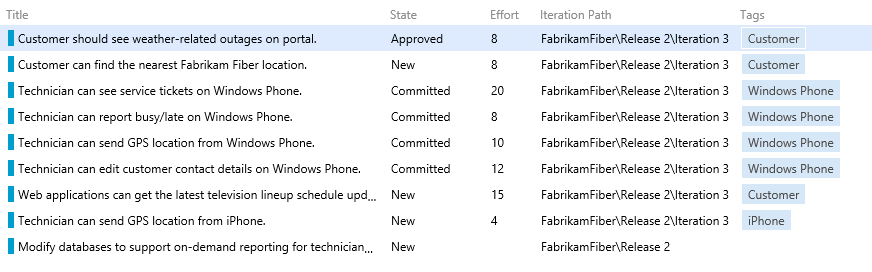

  New work item tags

1.  With the desired tagging in place, click the **Filter** button in
    the top-right corner of the backlog list.

    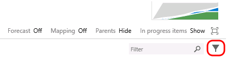

    Filter button

1.  Click the **Customer** tag to filter by just that tag.

  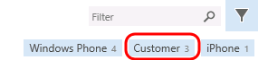
  Filtering by work item tag

1.  With this filtered view the teams will have a much easier time
    finding the work items that they should focus on first. Note that
    this filtering also disables the ability to add new backlog items,
    disables stack ranking and forecasting.

  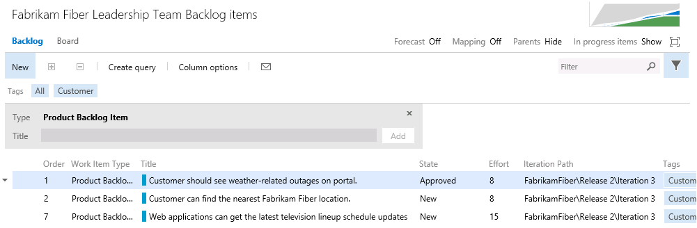
  Filtered backlog view

    >**Note:** Additional filtering can be done by selecting another tag
    (if there are any in this filtered subset). To remove the filter,
    simply click the Filter button once again.
  
