#Exercise 4: Work Item Charting

1.  In this exercise, we will demonstrate the work item charting
    capability of Team Foundation Server. Work item charting allows you
    to create visual chart representations of the data returned from TFS
    work item queries. This can be used to help better understand the
    state of projects.

#### Task 1: Creating and Sharing Work Item Charts

1.  Navigate to the **Fabrikam Fiber Leadership Team** (if necessary).

<!-- -->

1.  

<!-- -->

1.  Figure

<!-- -->

1.  Navigating to management team

<!-- -->

1.  

<!-- -->

1.  Let’s say that the Fabrikam Fiber management team would like to
    better understand how tasks are broken down by user. Navigate to the
    work item queries section of the web portal.

<!-- -->

1.  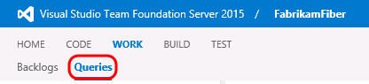

<!-- -->

1.  Figure

<!-- -->

1.  Work item queries view

<!-- -->

1.  

<!-- -->

1.  Since these charts are based on work items, we first need to define
    a query that will return the data that we are interested in. Click
    **New** and select the **New Query** option.

<!-- -->

1.  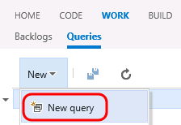

<!-- -->

1.  Figure

<!-- -->

1.  Creating a new work item query

<!-- -->

1.  

<!-- -->

1.  The default query will select all work items in any state for the
    current project. We want to select just Tasks, so modify the value
    of clause for **Work Item Type** to be **Task**.

<!-- -->

1.  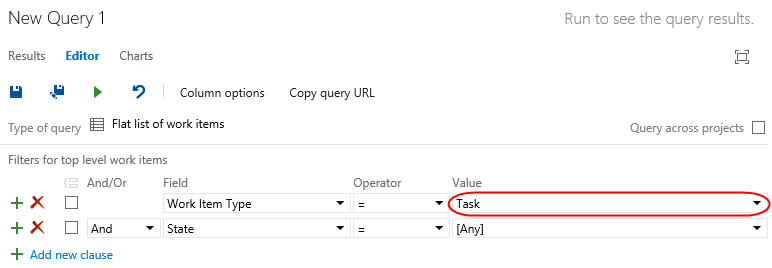

<!-- -->

1.  Figure

<!-- -->

1.  Querying for all tasks

<!-- -->

1.  Click the **Save Query As** button.

<!-- -->

1.  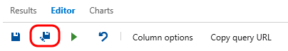

<!-- -->

1.  Figure

<!-- -->

1.  Saving new query

<!-- -->

1.  

<!-- -->

1.  **Note:** Work item charts require the associated query to return a
    flat list of work items.

<!-- -->

1.  Name the query “**All Tasks”**, select the folder “**Shared
    Queries**”, and then click **OK**.

<!-- -->

1.  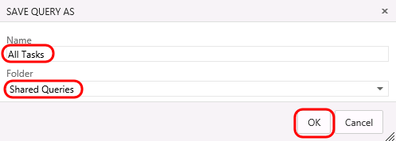

<!-- -->

1.  Figure

<!-- -->

1.  Naming new query

<!-- -->

1.  

<!-- -->

1.  Select the **Charts** tab.

<!-- -->

1.  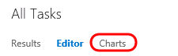

<!-- -->

1.  Figure

<!-- -->

1.  Charts link

<!-- -->

1.  

<!-- -->

1.  First we will create a pie chart showing tasks by assigned user.
    Click **New Chart**.

<!-- -->

1.  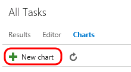

<!-- -->

1.  Figure

<!-- -->

1.  New Chart button

<!-- -->

1.  

<!-- -->

1.  Title the chart “**Tasks by User**”, group by the **Assigned To**
    field, and then click **OK**.

<!-- -->

1.  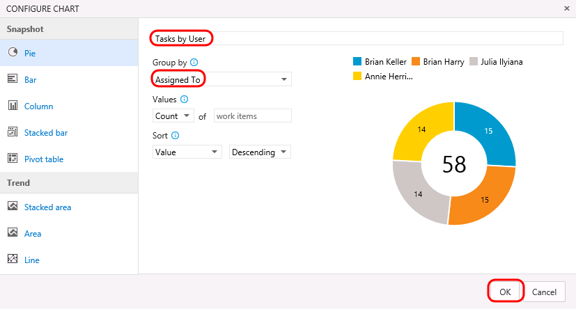

<!-- -->

1.  Figure

<!-- -->

1.  Creating new pie chart

<!-- -->

1.  

<!-- -->

1.  Let’s create one more chart to help visualize the task progress for
    each team member. Click **New Chart** once again.

2.  Select the **Stacked Bar** chart type. Note that this chart type
    requires you to specify two different fields for the rows
    and columns.

<!-- -->

1.  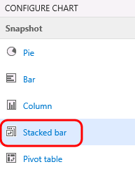

<!-- -->

1.  Figure

<!-- -->

1.  Creating a new stacked bar chart

<!-- -->

1.  

<!-- -->

1.  Title the chart “**Task State by User**”, select the **Assigned To**
    field for the **Rows**, select the **State** field for the
    **Columns**, and finally click **OK** to create the chart.

<!-- -->

1.  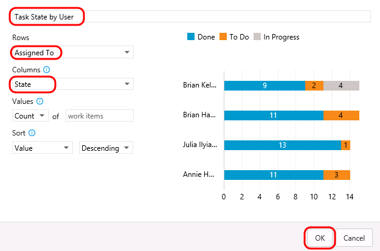

<!-- -->

1.  Figure

<!-- -->

1.  Creating a new stacked bar chart

<!-- -->

1.  

<!-- -->

1.  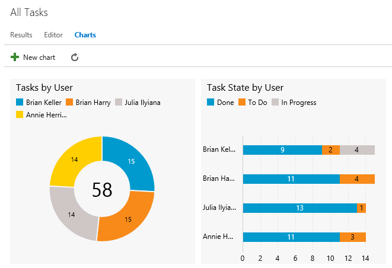

<!-- -->

1.  Figure

<!-- -->

1.  New task charts

<!-- -->

1.  

<!-- -->

1.  You can add to the available grouping options by modifying the work
    item query and adding in additional display columns. Select the
    **Editor** tab for the query.

<!-- -->

1.  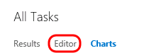

<!-- -->

1.  Figure

<!-- -->

1.  Editor link

<!-- -->

1.  

<!-- -->

1.  Click **Column Options**.

<!-- -->

1.  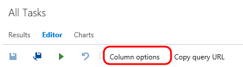

<!-- -->

1.  Figure

<!-- -->

1.  Column Options button

<!-- -->

1.  

<!-- -->

1.  Select the **Task** item for the **Work Item Type**.

<!-- -->

1.  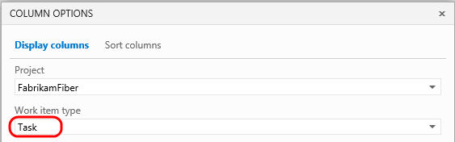

<!-- -->

1.  Figure

<!-- -->

1.  Filtering for Task fields

<!-- -->

1.  

<!-- -->

1.  **Double-click** the **Area Path** option from the Available
    Columns list.

<!-- -->

1.  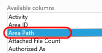

<!-- -->

1.  Figure

<!-- -->

1.  Selecting the Area Path field

<!-- -->

1.  

<!-- -->

1.  Click **OK**.

<!-- -->

1.  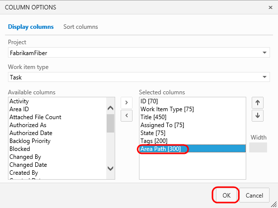

<!-- -->

1.  Figure

<!-- -->

1.  Selecting the Area Path field

<!-- -->

1.  

<!-- -->

1.  Click the **Save** button.

<!-- -->

1.  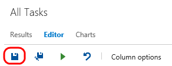

<!-- -->

1.  Figure

<!-- -->

1.  Saving modified query

<!-- -->

1.  

<!-- -->

1.  Select the **Charts** link to return to the charts view and use your
    charting skills to create a pie chart showing tasks grouped by the
    **Area Path** field. Title the chart “**Tasks by Team**”, select the
    **Area Path** field for the **Group By** field, and finally click
    **OK** to create the chart. This gives the management team an idea
    of how the work is distributed amongst the teams.

<!-- -->

1.  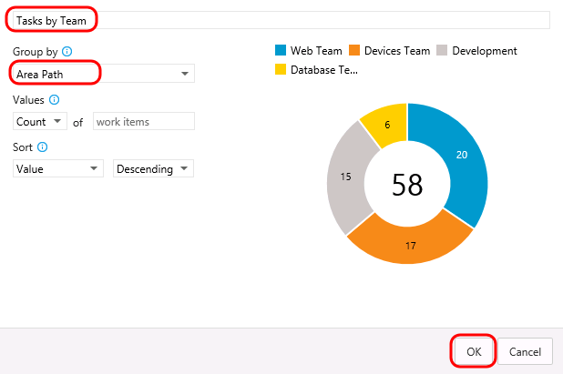

<!-- -->

1.  Figure

<!-- -->

1.  Creating new pie chart

<!-- -->

1.  

<!-- -->

1.  These lightweight charts can also be pinned to a dashboard. Click
    the **Tasks by Team** chart’s ellipses button and select **Add to
    dashboard | Overview**. This dashboard is used on the project’s
    home page.

<!-- -->

1.  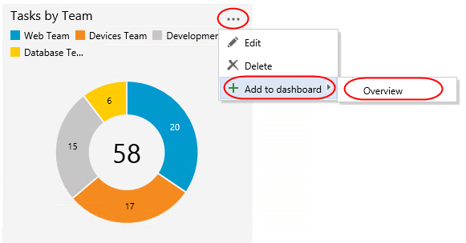

<!-- -->

1.  Figure

<!-- -->

1.  Task breakdown by team

<!-- -->

1.  

<!-- -->

1.  Click the **Home** link to return to the leadership team’s homepage
    and view the pinned chart.

<!-- -->

1.  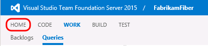

<!-- -->

1.  Figure

<!-- -->

1.  Home link

<!-- -->

1.  

<!-- -->

1.  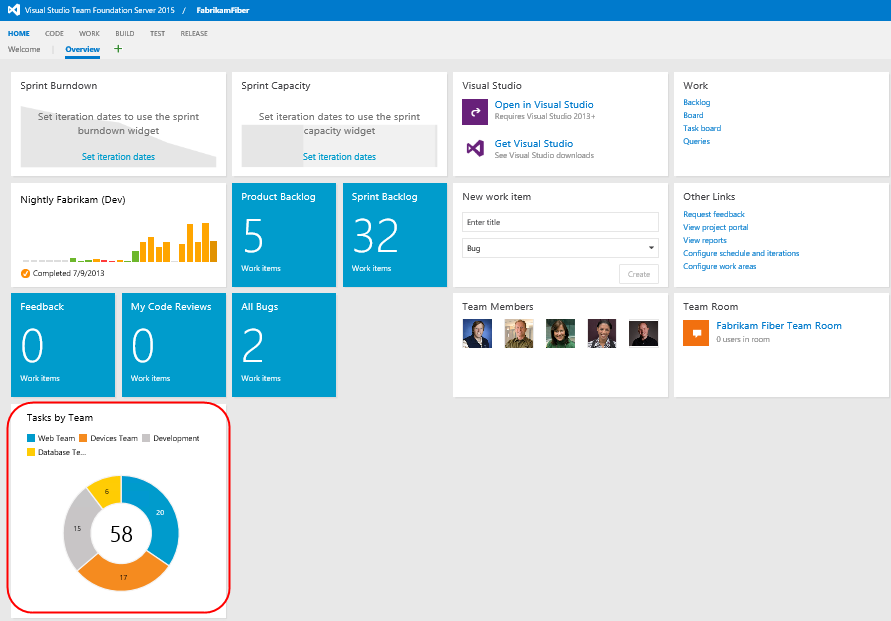

<!-- -->

1.  Figure

<!-- -->

1.  Team homepage showing pinned chart

#### Task 2: Customizing Dashboard

1.  You can also customize a dashboard by clicking the **Edit** button
    in the bottom right corner. This will switch the dashboard into
    **edit mode**. You need to be in edit mode in order to rearrange the
    dashboard or make configuration changes, which removes the risk of
    accidental edits during normal usage.

    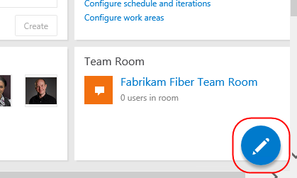

2.  Utilize the **Remove** buttons to clean up the dashboard a bit. It
    doesn’t matter which items you remove.

    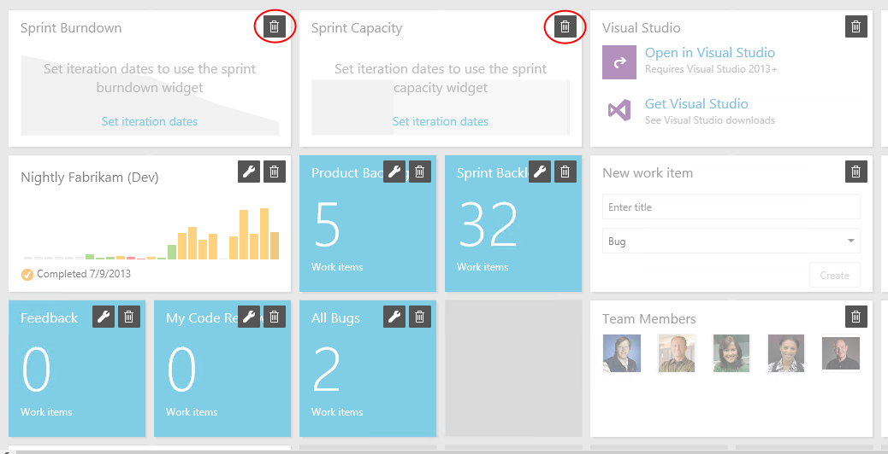

3.  You can also easily add new items to the dashboard by clicking the
    **Add Widget** button. Try it now.

    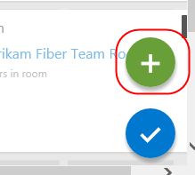

4.  Select the **Markdown** widget and click **Add**. This widget allows
    you to display any markdown file from your repository on
    the dashboard. Alternatively, you can provide the markdown manually.

    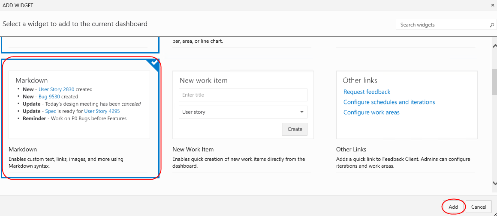

5.  Locate the Markdown widget on your dashboard and click its
    **Edit** button.

    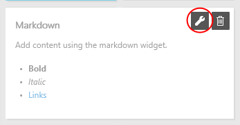

6.  This will provide you with access to key settings, such as the size
    of the widget, as well as the source of the Markdown to display.
    Press **Esc** to cancel.

    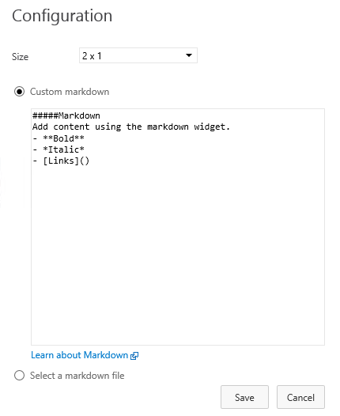

7.  Click the **Manage Dashboards** button in the top right corner of
    the view.

    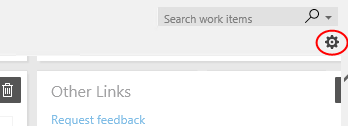

8.  This dialog provides access to functionality for managing your
    dashboard, including its creation. Note that each dashboard has an
    option to **Auto-refresh dashboard**, which is great for scenarios
    where you want to display information in public team areas, such as
    on large TVs.

    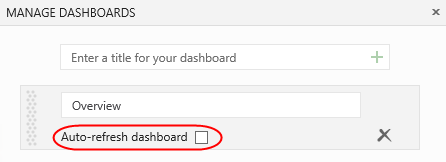

9.  When satisfied, click the **Close Edit Mode** button to apply
    all changes.

    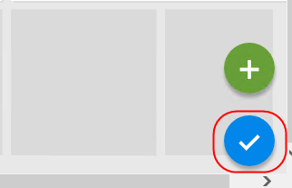

10. You can also create additional tabs for your dashboard in orders to
    offer different views into the project. Click the **Add a new
    Dashboard** button to create a new dashboard.

    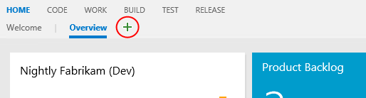

11. Enter **“Quality”** as the name and press **Enter**.

    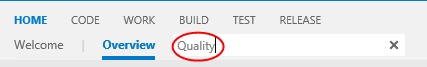

12. You now have multiple dashboard tabs and can edit and customize each
    using the same process from earlier.

    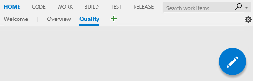

<!-- -->

1.  **Note**: After completing this lab, the virtual machine will
    continue to run with the date & time that was set for demonstration
    purposes at the beginning of this lab. Don’t forget to reset the
    virtual machine to its original snapshot/checkpoint after you
    complete this lab.

<!-- -->

1.  1.  2.  

    <!-- -->

    1.  

