#Exercise 2: Git Branching and Merging

  In this exercise, you will learn about Git branching and merging
    support in Visual Studio. In general, branching is often used to
    help switch development contexts and to isolate risk. Git branching
    is no different in that regard. Creating a Git branch is a
    lightweight (and therefore fast) operation, as you are simply
    creating a new reference to an existing commit. This is very
    different from Team Foundation Version Control (TFVC) branching
    where the entire source tree needs to be duplicated server-side. We
    will also take a quick look at the merging support for Git projects.

##Task 1: Branching

1.  Return to Visual Studio and open **Team Explorer – Home**.

2.  Click **Branches**.
   
   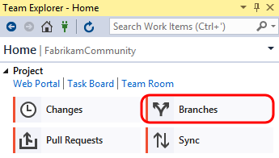

    **Figure** Branches tile

1.  Let’s say that we would like to create a new branch to do some
    development work on the web site. Right-click the **master** branch
    node and then select **New Local Branch From**.

   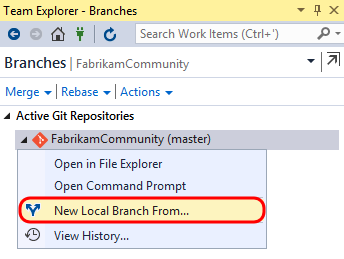

    **Figure** Creating new local branch

1.  Provide a name of **Development**, select the **master** branch,
    select the **Checkout Branch** option, and then click **Create
    Branch**.
    
   
  
    **Figure** Creating new branch

  >**Note:** It is also possible to create a new branch from backlog
    items or the Kanban board view of TFS.

    
    

1.  Note that you are now connected to the new local branch, and that it
    has not been published to the server yet.

    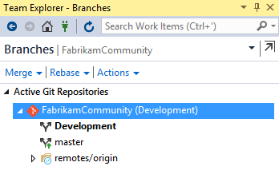

     **Figure** New local branch

1.  In **Solution Explorer**, open the **HomeController.cs** file from
    the **Controllers** folder.

2.  Modify the **About** method as shown in the following screenshot.
  
    

     **Figure** Modifying source code from new branch

1.  Right-click somewhere in the whitespace of the editor and select
    **Source Control | Commit**.

    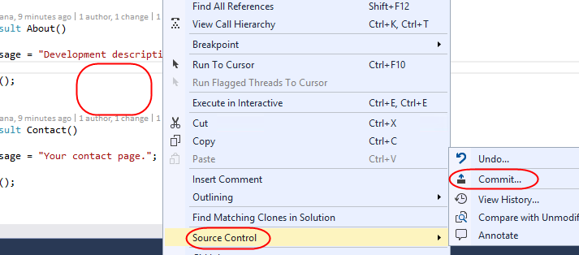

2.  In **Team Explorer - Changes**, enter a commit message of “**dev
    version**” and click **Commit All**. Save the changes when prompted.

    

     **Figure** Commit changes

1.  At this point, the changes have been committed locally. In the
    **Team Explorer – Changes** window, click the **Development** branch
    link to quickly navigate to the **Team Explorer - Branches** view.

   

   **Figure** Switching between branches

1.  Double-click the **Master** branch and note that original version of
    the *HomeController.cs* file is shown in the code editor window.

   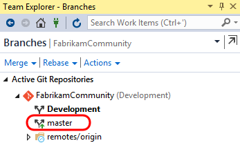
   
    **Figure**   Switching active branch

   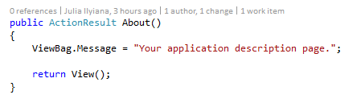
    
    **Figure** Switching between branches

1.  You don’t have to publish the branch to the server yet if you want
    to continue working locally. As you saw in the previous exercise,
    you can continue to work locally and add additional commits to the
    new branch. In **Team Explorer – Branches**, **right-click** the
    **Development** branch and select **View History**.

   
    
    **Figure** Viewing history for local branch

   

    **Figure** Source history for selected branch

1.  When you are ready, you can delete the branch, merge it back into
    your master branch, or push it to the server-side repository so that
    teammates can access it. Let’s go ahead and publish the branch by
    **right-clicking** the Development branch and selecting the
    **Publish Branch** option.
  
    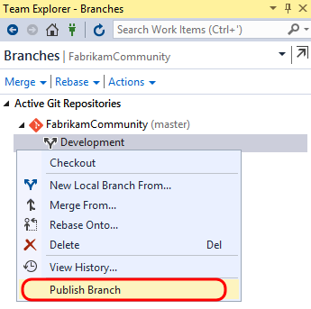

    **Figure** Publishing branch

    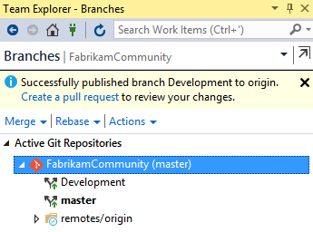

    **Figure** Successful publication

1.  Now let’s say that another team member makes a modification to the
    **HomeController.cs** file and commits that change to the master
    branch, before Julia has a chance to merge in her
    development changes.

2.  Open a **Remote Desktop** session to **VSALM**. Connect using user
    **Adam Barr** (VSALM\\Adam). All user passwords are **P2ssw0rd**.

3.  Launch **Visual Studio** from the taskbar.

4.  Connect to the **FabrikamCommunity** team project (using the
    **Manage Connections** button as before, and this time select
    **Manage Connections | Connect to Team Project**).

5.  Select the **FabrikamCommunity** team project and then click
    **Connect**.
 
   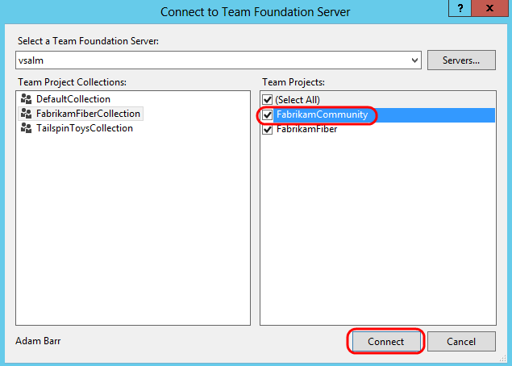

    **Figure** Connect to team project

1.  **Double-click** the **FabrikamCommunity** project shown in Team
    Explorer - Connect. Note that the Git project has a special icon.

    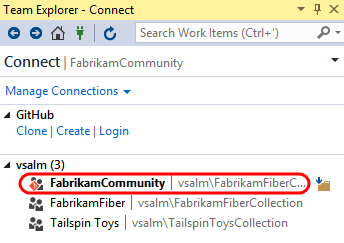
    
    **Figure** Connect to team project

1.  **Clone** the repository using default options as you did in the
    first exercise.

2.  Open the **Global Settings** from Team Explorer – Settings as you
    did in the first exercise and add an email address for Adam. The
    email address that you use does not matter for the purposes of
    this demonstration.

    

     **Figure** Setting up Git email

1.  **Double-click** the **MvcApplication1.sln** solution shown in
    **Team Explorer – Home**.

    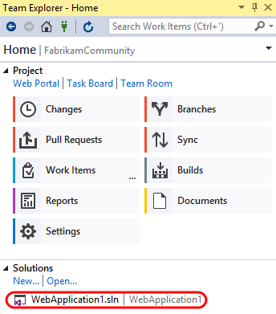

       **Figure** Open solution

1.  Modify the same ***HomeController.cs*** file that Julia did, but
    this time change the text to be something different.

    

     **Figure** Modifying web page title

1.  In **Team Explorer – Changes**, enter a commit message of “**Adam’s
    version**” and then click **Commit All**. Save changes
    when prompted. Note that Adam has committed changes to the
    master branch.

   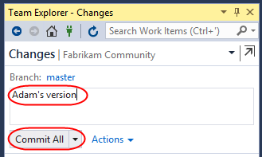
    
    **Figure** Commit changes

1.  Click **Sync** from the commit response.

  

    **Figure** Sync changes with server

1.  Click **Sync** to execute the actual sync.

  
    
    **Figure** Sync button

1.  Switch users back to **Julia** by minimizing the remote
    desktop session.

##Task 2: Merging

1.  From Julia’s perspective, she has so far created a local branch
    based off the master, made a change to a file, and then published
    that branch. Julia would like to go ahead and merge her Development
    branch back into the master branch.

2.  In **Team Explorer – Branches**, select the **Merge** dropdown.

 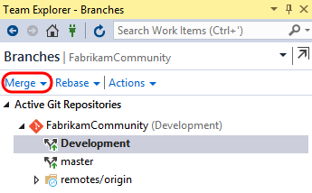

   **Figure** Merging Git branches 

1.  Select **Development** as the source and **Master** as the target.
    Click **Merge** to start the process. 
	
	

     **Figure** Merging Git branches 

1.  Note that the **Master** repository is currently selected and that
    ***HomeController.cs*** shows the development version of the text.
    The merge was performed locally by updating the Master branch to
    point to the latest commit of the Development branch. 
	
	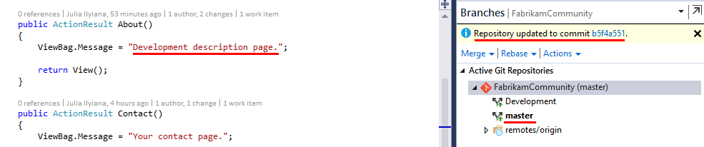

     **Figure** Merge completed locally 

1.  **Right-click** the **Master** branch in **Team Explorer –
    Branches** and select the **View History…** option.

    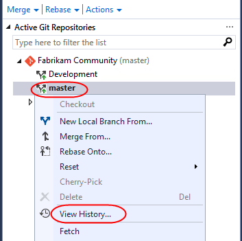

2.  The history view should look identical to the one you saw earlier,
    except this time both the Development and Master branch designators
    (in red) point to the same commit.

    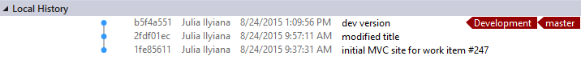

     **Figure** Merge completed locally 

1.  Still unaware of Adam’s change that he pushed to the Main branch
    earlier, Julia will now attempt to push her commit. Navigate to the
    **Team Explorer - Synchronization** view and then click **Sync** to
    attempt a pull and a push with the server. 
	
	

     **Figure** Sync with server repository 

    >**Note:** If you see a popup notifying that an open file has been
    changed externally, click **Yes** as this is expected.

1.  Visual Studio reports that we can’t push our commit yet due to
    a conflict. 
	
	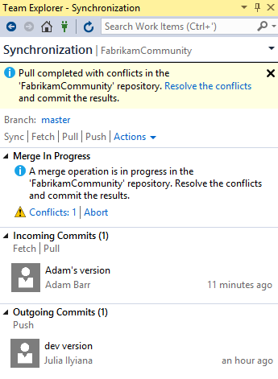

     **Figure** Conflict between two different commits 

1.  Click **Resolve the Conflicts**. 

    

     **Figure** Resolving conflicts 
	 
1.  In the **Team Explorer – Resolve Conflicts** view, select the
    ***HomeController.cs*** file listed under the Conflicts section and
    then click **Merge**. 
	 
	 

     **Figure** Starting manual merge process 

1.  The Merge window used for Git conflict resolution is very similar to
    the one used with Team Foundation Version Control. We will go ahead
    and assume that Julia’s change is correct, so check the box shown in
    the top-right pane. 
	
	

     **Figure** Merge window 

1.  Click **Accept Merge**. 

	 

     **Figure** Merge window 

1.  Click **Commit Merge**.

1.  

     **Figure** Commit the resolved merge 

1.  In the Team Explorer – Changes view, note that conflicts have been
    resolved but the merge still needs to be committed. Enter a message
    and then click **Commit All**. Save changes when prompted. 
	
	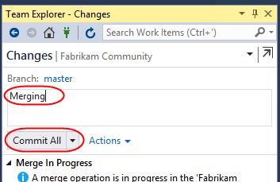

     **Figure** Commit the resolved merge 

1.  Click **Sync**. 

    

     **Figure** Unsynced Commits  

1.  Click **Sync** to finish the merge process. 

	

     **Figure** Syncing with server 

1.  Click **Web Portal** from **Team Explorer – Home**. 

	

     **Figure** Opening the Fabrikam Fiber web portal 

1.  Select the **Code** tab. 

    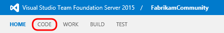

     **Figure** Navigating to Code view 

1.  Select the **History** tab to view all commits pushed to
    the repository.

    

     **Figure** Commits view 

1.  Select the **Branches** tab to view all branches published to
    the repository. 
	
	

     **Figure** Branches view  

##Task 3: Managing Security and Permissions

1.  Now let’s take a quick peek at managing security and permissions for
    Git repositories hosted in Team Foundation Server. Select the
    **FabrikamCommunity** dropdown and then **Manage Repositories**.

	

     **Figure**  Managing repositories 

1.  The first thing to note is that you can create additional Git
    repositories within the same team project.

	 

     **Figure**  Option to create additional Git repositories  

1.  Select the **FabrikamCommunity** repository node.

    

     **Figure**  Navigating to repository node

1.  You can manage repository level security here for your users and
    security groups.

    

     **Figure**  Managing repository security  

1.  Select the **Master** branch node. Security level settings that
    affect only the currently selected branch can be made here,
    providing fine-grained control for your repository if needed.

	

     **Figure**  Managing branch security    

##Task 4: Branch Policies

1.  When you want people on your team to review code in a Git team
    project, you can use a pull request to review and merge the code.
    Pull requests enable developers working in topic branches to get
    feedback on their changes from other developers prior to submitting
    the code into the master branch. Any developer participating in the
    review can see the code changes, leave comments in the code, and
    give a "thumbs up" approval if they're satisfied with those changes.

1.  Navigate to the administrative section for the FabrikamCommunity
    project in the portal and then select the **master** branch. You
    should already be there if continuing on from the previous task.

    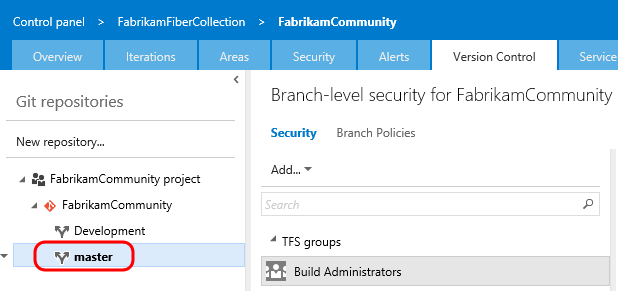

     **Figure**  Master branch  

1.  Although it is possible to utilize pull requests without any further
    configuration, let’s take a quick look at how to setup
    branch policies. Select the **Branch Policies** tab. 

	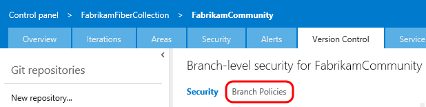

     **Figure**  Branch policies tab   

1.  You can make use of branch policies that effectively put in a gate
    that helps prevent inadvertent or low quality commits by
    automatically initiating a build, or by requiring code reviews by
    certain individuals. Select the option to **Require…reviewers per
    pull request** and set the minimum number of reviewers to “1”. 
	 
	 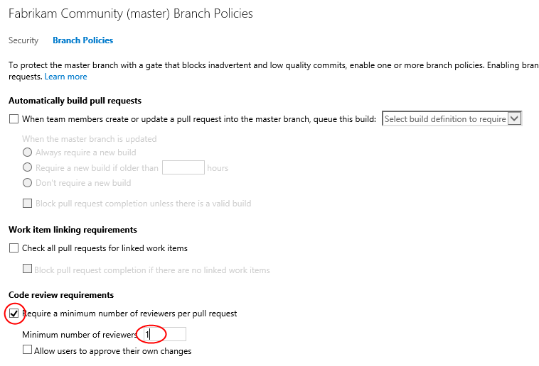

     **Figure**  Require code reviews  

  >**Note:** It is also possible to configure branch policy such that a
    build is triggered whenever updates are made to the master branch.
    You can even have the merge fail when the build fails. This is
    useful for teams looking to adopt continuous integration.

1.  It is also possible to require specific reviewers for specific
    portions of your code base. For example, let’s say that Julia needs
    to sign off on all changes made to the ASP.NET MVC controllers.
    Click **Add a new path**.  
	
	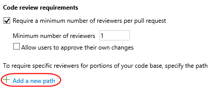

     **Figure**  Add required reviewers based on code path  

1.  Leave the default options of **Enabled** and **Required** selected,
    set the **Path** to be everything in the **Controllers** folder, and
    then click **Add User**.  
	 
	 

     **Figure**  Add required reviewers based on code path  

1.  Select **Julia Ilyiana** from the Add Required Reviewers window and
    then click **Save Changes**.

	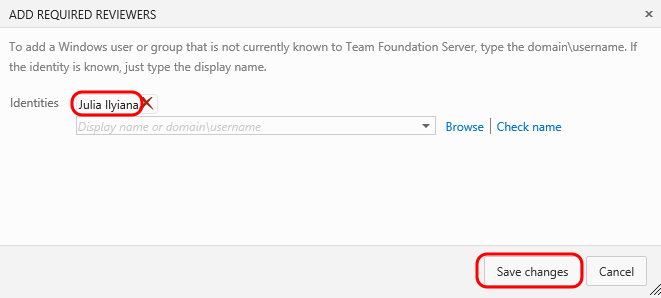

     **Figure**  Add required reviewer  

1.  Click **Save Changes** to update the master branch policies. Close
    the administration browser tab.

	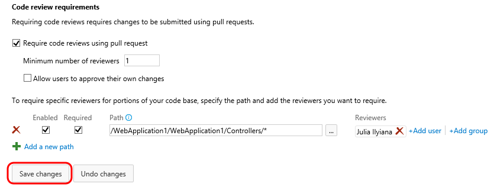

     **Figure**  Updating branch policies    

##Task 5: Code Review and Merge using Pull Requests

1.  Switch users back to **Adam** and ensure that you are connected to
    the FabrikamCommunity project still.

2.  In the **Team Explorer - Branches** view, double-click **master** to
    change to that branch.

3.  In the **Team Explorer - Synchronization** view, note that there are
    two incoming commits listed (if there are not, try a
    **Fetch** operation).

4.  Click **Sync** to ensure that the local copy of master matches
    what’s on the server. If you have **HomeController.cs** open in the
    editor, you may be prompted to reload it. 
	
	

     **Figure**  Synchronize with server  

1.  Now let’s say that Adam is working on the project and needs to
    update some of the controller code. To do this, he will first create
    a topic branch based on master. In **Team Explorer - Branches**,
    right-click the **master** branch and select **New Local Branch
    From**…  
	
	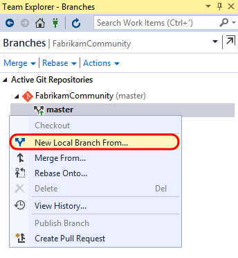

     **Figure**  Creating local topic branch 

1.  For the branch name, use something like
    “**users/adam/controllerupdate**”. Use the default option to
    “**Checkout branch**”. Click **Create Branch**.

    

     **Figure**  Creating local topic branch 

1.  Update the **About** method from **HomeController.cs** with a new
    message, something like “**Adam’s enhanced description page.**”

	

     **Figure**  Code update  

1.  In **Team Explorer - Changes**, provide a commit message and then
    **Commit All**. Save the changes when prompted.

	

     **Figure**  Commit change  

1.  In **Team Explorer - Branches**, right-click the topic branch and
    select **Publish Branch**.

	

     **Figure**  Publish topic branch  

1.  After successfully publishing the branch, click **Create a pull
    request**.

    

     **Figure**  Initiating a pull request 

1.  Check **Open in browser after creating pull request** and click
    **Create** to create a pull request with the default options.

    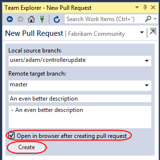

2.  After the pull request is created, note that the pull request view
    shows what merge is proposed, Adam’s description is provided, and
    there are tabs listing affected files and commits. It also indicates
    that there are no merge conflicts detected, and that due to branch
    policy, Julia must approve the changes in order to proceed

    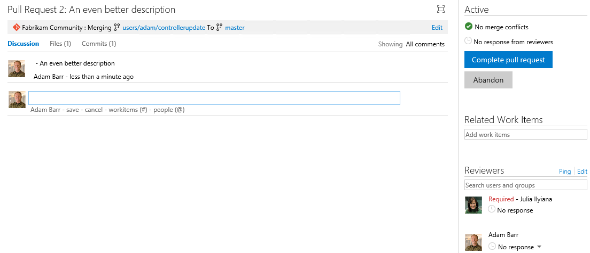

     **Figure**  Pull request view  

1.  To demonstrate the branch policy in action, let’s say Adam attempts
    to complete the pull request by himself. Click **Complete Pull
    Request**.

	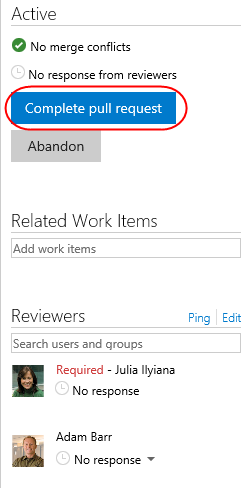

     **Figure**  Attempt to complete pull request  

1.  When asked to confirm the merge, notice the warning about the merge
    going against policy. Click **Complete merge** to try anyway.

 	

     **Figure**  Attempt to complete pull request  

1.  Note that Adam is notified that the request first needs to be
    approved by all required reviewers first.

    

     **Figure**  Attempt to complete pull request  

1.  At this point in the workflow, Julia needs to be notified of this
    pull request through some communication channel, whether that is in
    person, through Skype, through team room notification, or via TFS
    pull request alert. For the purposes of this short exercise,
    however, we will just skip to Julia checking pull requests for
    this project.

2.  Switch users back to **Julia**.

3.  In the web portal, navigate to the **FabrikamCommunity** project and
    the **Code | Pull Requests** view.

    

     **Figure**  Pull requests view  

1.  Select the link provided on the pull request from Adam.

    

     **Figure**  Viewing pull request  

1.  At this point, Julia can review all of the files and commits
    associated with the pull request and make a decision. It is also
    possible for Julia to have a conversation with Adam (and perhaps
    other reviewers) in order to help make the decision, or perhaps even
    request additional work be performed before the pull request will
    be approved.

2.  Let’s assume that Julia is ready to approve the request as-is, so
    select the response drop down underneath Julia’s name in the
    Reviewers section and select the **Approved** option. 

	

     **Figure** Approving pull request  

1.  Note that the **Active** section now shows that there are no merge
    conflicts and that required reviewers have indicated approval. Click
    **Complete Pull Request** to complete the pull request and merge
    changes from Adam’s topic branch into master.

	

     **Figure** Completing pull request

1.  Now when the pull request confirmation is shown, you can click
    **Complete merge** with success. Note that you have the option to
    delete the source branch as part of the process.

    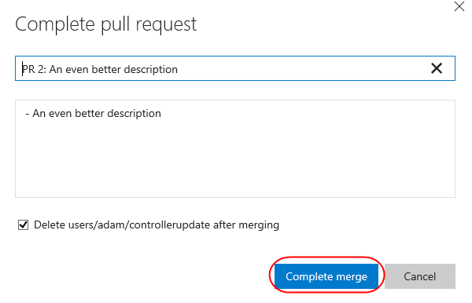

2.  Switch users back to **Adam**.

3.  Refresh the pull request view and note that it has been updated as
    expected with the actions made by Julia.

	

     **Figure** Completed pull request   
