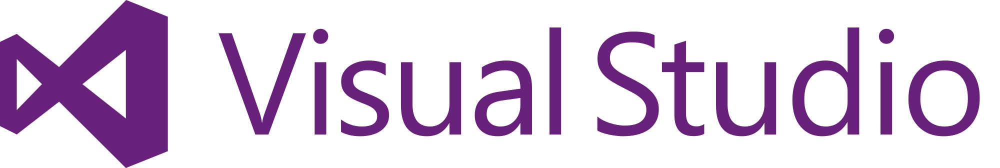

Hands-On Lab
#Getting Started with Git using Team Foundation Server 2015

Lab version: 14.0.25123.0
Last updated: 5/5/2016

### TABLE OF CONTENT
<table>
<tr><th>Getting started with git using team foundation server 2015</th></tr>
<tr><td><a href="./README.md#overview">OVERVIEW</a></td></tr>
<tr><td><pre><a href="./README.md#prerequisites">Prerequisites</a>
<a href="./README.md#about-the-fabrikam-fiber-scenario">About the Fabrikam Fiber Scenario</a>
<a href="./README.md#Exercises">Exercises</a></pre></td></tr>
<tr><td>EXERCISE 1: GETTING STARTED WITH GIT</td></tr>
<tr><td><pre>
Task 1: Create Git Repository
Task 2: Clone Git Repository
Task 3: Commit Code and Link to Work Item
Task 4: Synchronize Commits with Server
</pre></td></tr>
<tr><td>EXERCISE 2: GIT BRANCHING AND MERGING</td></tr>
<tr><td><pre>
Task 1: Branching
Task 2: Merging
Task 3: Managing Security and Permissions
Task 4: Branch Policies
Task 5: Code Review and Merge using Pull Requests
</pre></td></tr>
</table>

##Overview

1.  In this lab, you’ll learn about Git support in Team Foundation
    Server 2015 and Visual Studio 2015. Git is a distributed version
    control system. Git repositories can live locally (such as on a
    developer’s machine) and can now be hosted by Team
    Foundation Server. You will learn how to establish a local Git
    repository, which can easily be synchronized with a centralized Git
    repository in Team Foundation Server. In addition, you will learn
    about Git branching and merging support.

##Prerequisites

1.  In order to complete this lab you will need the Visual Studio 2015
    virtual machine provided by Microsoft. For more information on
    acquiring and using this virtual machine, please see [this blog
    post](http://aka.ms/ALMVM).

##About the Fabrikam Fiber Scenario

1.  This set of hands-on-labs uses a fictional company, Fabrikam Fiber,
    as a backdrop to the scenarios you are learning about. Fabrikam
    Fiber provides cable television and related services to the
    United States. They are growing rapidly and have embraced Windows
    Azure to scale their customer-facing web site directly to end-users
    to allow them to self-service tickets and track technicians. They
    also use an on-premises ASP.NET MVC application for their customer
    service representatives to administer customer orders.

    In this set of hands-on labs, you will take part in a number of
    scenarios that involve the development and testing team at
    Fabrikam Fiber. The team, which consists of 8-10 people, has decided
    to use Visual Studio application lifecycle management tools to
    manage their source code, run their builds, test their web sites,
    and plan and track the project.
    
##Exercises

This hands-on lab includes the following exercises:

 1.  Getting Started with Git

 2.  Git Branching and Merging

 Estimated time to complete this lab: **60 minutes**.
