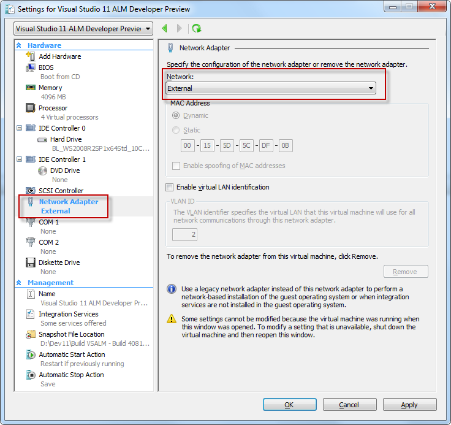
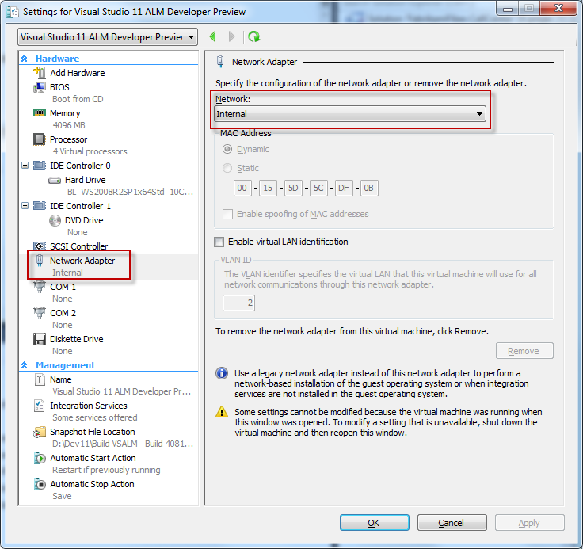

Release Notes Version 2016.4.25  
For the latest version of these instructions, the virtual machine, and
other content, visit <http://aka.ms/almvm>.  
**Microsoft® Visual Studio® 2015 Application Lifecycle Management
Virtual Machine**

General Release Notes
---------------------

The Microsoft® Visual Studio® 2015 Application Lifecycle Management
Virtual Machine is a single virtual machine image that contains fully
installed and configured copies of the software listed below. This
virtual machine requires Hyper-V, and can be used with Windows Server
2008 R2 SP1, Windows 8 (SLAT-capable processor required)/Windows Server
2012, Windows 8.1/Windows Server 2012 R2, or Windows 10. The detailed
instructions in this document assume that you are using Windows 8,
although the instructions are similar for other operating systems.

The virtual machine contains the following pre-configured software:

1.  Microsoft Windows Server 2012 R2 Datacenter Evaluation

2.  Microsoft Visual Studio Enterprise 2015 Update 2

3.  Microsoft Visual Studio Team Foundation Server 2015 Update 2

4.  Microsoft Office Professional Plus 2013 (Word, PowerPoint,
    Excel, Outlook)

5.  Microsoft Visio Professional 2015

6.  Microsoft Release Management for Visual Studio 2015 Update 2

7.  Microsoft SQL Server 2012 Standard

8.  Microsoft SharePoint Foundation 2015

9.  Sample users and data required to support hands-on-lab scripts which
    accompany this download.

Activation
----------

The virtual machine requires online activation if you wish to use it
more than 10 days. For this to occur, your VM will need to be connected
to a virtual network that has Internet access. We strongly recommend
that you only connect this virtual machine to the Internet temporarily
and promptly disable Internet access once activation is complete. Please
refer to the section “*Configure this Virtual Machine with Hyper-V*”
below for more information.

Expiration
----------

If you choose to activate your virtual machine, it will begin a 180-day
trial of Windows Server 2012 Standard Evaluation. After the 180 days is
over you will need to stop using this virtual machine.

Rollback
--------

It is strongly recommended that you implement a rollback strategy for
restoring this virtual machine to a previous point in time. This is
helpful in case you make a mistake, or if you want to reset the state of
the original sample data contained within this virtual machine. Hyper-V
uses a concept called *snapshotting.* The hands-on-labs which were built
for use with this virtual machine were tested using a “clean” state of
the virtual machine; therefore it is recommended that you restore to a
clean snapshot before you start each hands-on-lab. See the section
titled “Working with *Snapshots*” below for more information.

**Note**: Starting with Windows 8.1/Windows Server 2012 R2, “snapshots”
are referred to as “checkpoints”.

Labs / Demo Scripts
-------------------

A set of hands-on-lab documents, which also function as demo scripts,
are available for download along with this virtual machine. The latest
version of these documents can be downloaded from
[here](http://aka.ms/almvm). These hands-on-labs provide a guided
experience for you to learn about the new application lifecycle
management capabilities of Visual Studio 2015, as well as application
lifecycle management features which have been introduced since Visual
Studio 2010.

Recommend System Configuration
------------------------------

You will want to provide as much RAM as possible to this virtual
machine. A minimum of 6GB is suggested. But you should not allocate all
of your physical memory to a virtual machine or you can “starve” your
host machine of the RAM it needs to complete other tasks. For example,
if you have 12GB of physical memory on your computer then a good
allocation for your virtual machine might be 8GB. This can be a process
of trial and error.

By default, when you import this virtual machine it will be configured
with a certain amount of RAM and number of virtual processors. If you
have the necessary hardware, you can increase this allocation after the
import step by using the Hyper-V console and accessing the settings for
this virtual machine.

If you have more than one hard drive, place the VHD file on a physical
drive that is different from your system drive. Use the drive with the
faster spindle rate if it is a mechanical drive or use an SSD drive. If
you use an external hard drive, faster interfaces such as eSata or
Firewire 800 will work better. Be careful with slower laptop drives and
USB 1.1 interfaces.

|                                      | Requirement for Hyper-V Host Machine                              |
|--------------------------------------|-------------------------------------------------------------------|
| Operating System                     | Microsoft Windows® Server 2008 R2 with the Hyper-V role enabled   
                                        Microsoft Windows® Server 2012 with the Hyper-V role enabled       
                                        Microsoft Windows® 8 with Hyper-V enabled                          
                                        Microsoft Windows® 8.1 with Hyper-V enabled                        
                                        Microsoft Windows® Sever 2012 R2 with Hyper-V enabled              
                                        Microsoft Windows® 10 with Hyper-V enabled                         |
| Drive Formatting                     | NTFS                                                              |
| Processor                            | Intel VT or AMD-V capable                                         
                                        *SLAT-capable CPU required if using Windows 8*                     |
| RAM                                  | 8 GB of free physical RAM (9 GB or more recommended)              |
| Hard disk space required for install | 80 GB (more if using snapshots).                                  |

How to Log In
-------------

Press Ctrl+Alt+End instead of Ctrl+Alt+Del. All accounts use the same
password: **P2ssw0rd** (capital letter P, the number two, the letter s,
the letter s, the letter w, the number zero, the letter r, and the
letter d).

**Note**: after you send the Ctrl+Alt+Del to the VM, you will be
prompted to log in as the user that last used the machine. To see the
list of available users, simply press the left arrow to the left hand
side of the login.

Configure this Virtual Machine with Hyper-V
-------------------------------------------

This section lists the tasks that you must perform using a server with
the Hyper-V role enabled.

| 1.  Import and configure the Virtual Machine                                                                               
                                                                                                                             
 > Due to the activation and expiration models in Windows Server, it’s highly recommended that you do one of the following:  
                                                                                                                             
 -   Retain a copy of the unaltered VM                                                                                       
                                                                                                                             
 -   Create and retain a snapshot from before first run of the VMs                                                           | 1.  Under **Actions**, click **Import Virtual Machine**…                                                                                                                                                                                                                                                                                               
                                                                                                                                                                                                                                                                                                                                                                                                                                                                                      
                                                                                                                              2.  If you are going to import to a Windows Server 2008 R2 machine, move the VHD file from the WMIv2\\Virtual Hard Disks folder to the WMIv1\\Virtual Hard Disks folder.                                                                                                                                                                                
                                                                                                                                                                                                                                                                                                                                                                                                                                                                                      
                                                                                                                              3.  Use the **Browse** button to select the folder where the virtual machine package was extracted. Keep default settings. Browse to either the **“WMIv1**” or “**WMIv2**” folder depending upon if you are going to import to Server 2008 R2 OR Windows8.1/Server 2012 R2, respectively.                                                               
                                                                                                                                                                                                                                                                                                                                                                                                                                                                                      
                                                                                                                              4.  Click **Select Folder** when you have browsed to this path.                                                                                                                                                                                                                                                                                         
                                                                                                                                                                                                                                                                                                                                                                                                                                                                                      
                                                                                                                              5.  Click **Next** through each remaining page of the import wizard, then **Finish**, and wait for the import operation to complete.                                                                                                                                                                                                                    
                                                                                                                                                                                                                                                                                                                                                                                                                                                                                      
                                                                                                                              6.  The new virtual machine will show up in your Virtual Machines list.                                                                                                                                                                                                                                                                                 
                                                                                                                                                                                                                                                                                                                                                                                                                                                                                      
                                                                                                                              7.  Optionally, you can right-click this virtual machine to configure various **Settings.** For example you may wish to increase the number of virtual processors (depending on your hardware) or adjust the amount of RAM allocated to this virtual machine. Read the “Recommended System Configuration” section above for tips about RAM allocation.  
                                                                                                                                                                                                                                                                                                                                                                                                                                                                                      
                                                                                                                              8.  **Start** the virtual image.                                                                                                                                                                                                                                                                                                                        
                                                                                                                                                                                                                                                                                                                                                                                                                                                                                      
                                                                                                                              9.  Once the machine starts, log in as Brian (press CTRL + ALT +END) to login. Password is P2ssw0rd.                                                                                                                                                                                                                                                    
                                                                                                                                                                                                                                                                                                                                                                                                                                                                                      
                                                                                                                              10. After you login it may take a few minutes to finish the configuration install new drivers. Once done, you may be prompted to reboot.                                                                                                                                                                                                                
                                                                                                                                                                                                                                                                                                                                                                                                                                                                                      
                                                                                                                              11. After reboot the machine is ready to use.                                                                                                                                                                                                                                                                                                           |
|----------------------------------------------------------------------------------------------------------------------------|--------------------------------------------------------------------------------------------------------------------------------------------------------------------------------------------------------------------------------------------------------------------------------------------------------------------------------------------------------|
| 1.  Activate the operating system                                                                                          
                                                                                                                             
 > This step is should be automatic once you connect the VM to the Internet.                                                 | 1.  Open the Hyper-V Manager on the host.                                                                                                                                                                                                                                                                                                              
                                                                                                                                                                                                                                                                                                                                                                                                                                                                                      
                                                                                                                              2.  Select the VM in the Virtual Machines pane.                                                                                                                                                                                                                                                                                                         
                                                                                                                                                                                                                                                                                                                                                                                                                                                                                      
                                                                                                                              3.  Click Settings in the Actions pane.                                                                                                                                                                                                                                                                                                                 
                                                                                                                                                                                                                                                                                                                                                                                                                                                                                      
                                                                                                                              4.  Configure the network adapter to use an external network adapter. *(For information on how to configure an external network adapter with Hyper-V please consult the Hyper-V documentation)*                                                                                                                                                         
                                                                                                                                                                                                                                                                                                                                                                                                                                                                                      
                                                                                                                              5.  Your settings should resemble the following screenshot (the actual name of your external network may vary)                                                                                                                                                                                                                                          
                                                                                                                                                                                                                                                                                                                                                                                                                             
                                                                                                                                                                                                                                                                                                                                                                                                                                                                                      
                                                                                                                              6.  Click OK to close the settings dialog.                                                                                                                                                                                                                                                                                                              
                                                                                                                                                                                                                                                                                                                                                                                                                                                                                      
                                                                                                                              7.  **Start** the virtual machine if it isn’t already running.                                                                                                                                                                                                                                                                                          
                                                                                                                                                                                                                                                                                                                                                                                                                                                                                      
                                                                                                                              8.  Once the machine starts, log in as Brian (press CTRL + ALT +END) to login. Password is P2ssw0rd.                                                                                                                                                                                                                                                    
                                                                                                                                                                                                                                                                                                                                                                                                                                                                                      
                                                                                                                              9.  Typically, you can simply give the guest OS a few minutes in order to automatically activate the 180 day trial, but you can always double-check in the Control Panel.                                                                                                                                                                               
                                                                                                                                                                                                                                                                                                                                                                                                                                                                                      
                                                                                                                              10. From the Start menu, open the **Control Panel**.                                                                                                                                                                                                                                                                                                    
                                                                                                                                                                                                                                                                                                                                                                                                                                                                                      
                                                                                                                              11. Double-click on the **System** control panel applet.                                                                                                                                                                                                                                                                                                
                                                                                                                                                                                                                                                                                                                                                                                                                                                                                      
                                                                                                                              12. If necessary, click on **Activate Windows Now** at the bottom of the System applet.                                                                                                                                                                                                                                                                 
                                                                                                                                                                                                                                                                                                                                                                                                                                                                                      
                                                                                                                              13. Click on **Activate Windows online now**. If you have successfully enabled Internet access for your virtual machine then this step should just take a few moments.                                                                                                                                                                                  
                                                                                                                                                                                                                                                                                                                                                                                                                                                                                      
                                                                                                                              14. Your virtual machine will now remain active for up to 180 days from this point in time. You can confirm this by looking at the bottom of the System control panel applet.                                                                                                                                                                           
                                                                                                                                                                                                                                                                                                                                                                                                                                                                                      
                                                                                                                              15. Proceed to step 3 below to configure your virtual machine for use with an **internal** network adapter. Step 3 is very important since there is no active virus protection software on this virtual machine, and it may not contain the latest security patches, so you shouldn’t leave this virtual machine in an Internet-facing state.           |
| 3. Configure an internal network adapter                                                                                   | 1.  Open the **Hyper-V Manager** on the host.                                                                                                                                                                                                                                                                                                          
                                                                                                                                                                                                                                                                                                                                                                                                                                                                                      
                                                                                                                              2.  Select the VM in the Virtual Machines pane.                                                                                                                                                                                                                                                                                                         
                                                                                                                                                                                                                                                                                                                                                                                                                                                                                      
                                                                                                                              3.  Click **Settings** in the Actions pane.                                                                                                                                                                                                                                                                                                             
                                                                                                                                                                                                                                                                                                                                                                                                                                                                                      
                                                                                                                              4.  Configure the network adapter to use an internal network adapter. *(For information on how to configure an external network adapter with Hyper-V please consult the Hyper-V documentation)*                                                                                                                                                         
                                                                                                                                                                                                                                                                                                                                                                                                                                                                                      
                                                                                                                              5.  Your settings should resemble the following screenshot (the actual name of your internal network may vary)                                                                                                                                                                                                                                          
                                                                                                                                                                                                                                                                                                                                                                                                                             
                                                                                                                                                                                                                                                                                                                                                                                                                                                                                      
                                                                                                                              6.  Click OK to **close** the settings dialog.                                                                                                                                                                                                                                                                                                          
                                                                                                                                                                                                                                                                                                                                                                                                                                                                                      
                                                                                                                              7.  It is highly recommended that you now take a snapshot of the virtual machine so that you can return to this state later if you need to. See “*Working with Snapshots*” below for more information.                                                                                                                                                  |

Working with Snapshots
----------------------

Hyper-V introduces the concept of “snapshots” which can be used to
revert a virtual machine to a previous configuration state. The
hands-on-labs which were built for use with this virtual machine were
tested for use with a “clean” state of the virtual machine; it is
recommended that you restore to a clean snapshot before you start each
hands-on-lab. As delivered, this virtual machine does not include any
snapshots.

| Tasks                                                                                                                                                                  | Detailed steps                                                                                                                                                                                                     |
|------------------------------------------------------------------------------------------------------------------------------------------------------------------------|--------------------------------------------------------------------------------------------------------------------------------------------------------------------------------------------------------------------|
| 1.  Create a Snapshot                                                                                                                                                  
                                                                                                                                                                         
 Note that having many snapshots can adversely affect performance. You can delete snapshots you no longer need and Hyper-V will merge these when the VM is not running.  | 1.  Prepare the VM(s) in the state you wish to capture.                                                                                                                                                            
                                                                                                                                                                                                                                                                                                                                                                                              
                                                                                                                                                                          2.  Open or return to the Hyper-V Manager                                                                                                                                                                           
                                                                                                                                                                                                                                                                                                                                                                                              
                                                                                                                                                                          3.  Select the VM and click Snapshot under Actions.                                                                                                                                                                 
                                                                                                                                                                                                                                                                                                                                                                                              
                                                                                                                                                                          4.  Wait for the snapshot captures to complete.                                                                                                                                                                     
                                                                                                                                                                                                                                                                                                                                                                                              
                                                                                                                                                                          5.  (optional) Right-click a snapshot to rename it.                                                                                                                                                                 |
| 1.  Apply a Snapshot                                                                                                                                                   | 1.  Open or return to the Hyper-V Manager                                                                                                                                                                          
                                                                                                                                                                                                                                                                                                                                                                                              
                                                                                                                                                                          2.  Select the VM, right-click on the snapshot you wish to use, and choose Apply. You will be prompted to save the current state as a snapshot. Doing so will retain your current state, skipping will discard it.  |

Date and Time
-------------

Previous versions of this virtual machine were hard-coded to boot up
with a specific demo date that was in the past. This updated version of
the virtual machine will match the real-world date and time by default,
eliminating many of the headaches associated with being disconnected
from the real-world date. Only one lab requires the date to be set
specifically to a certain demo date (the Agile Planning and Portfolio
Management lab), and instructions for how to do this are provided at the
beginning of that lab.

Feedback
--------

If you have comments or general feedback, please e-mail
<vskitfdbk@microsoft.com>.
